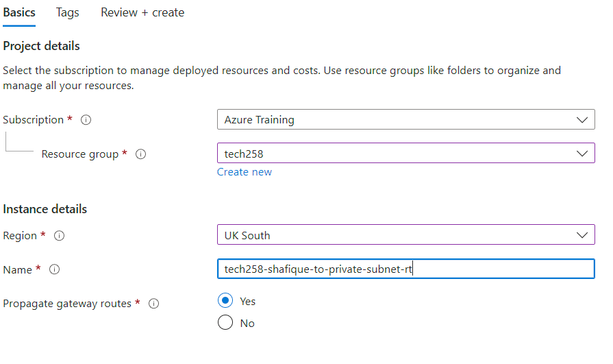
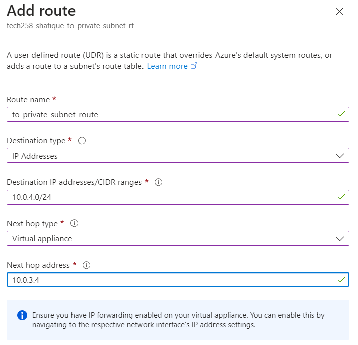
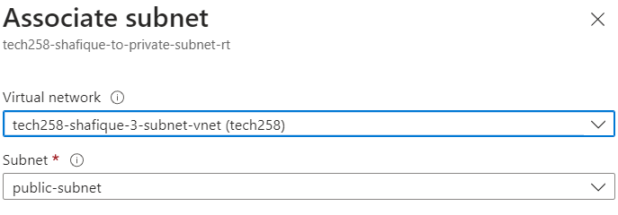

# Tech 258 - Network Virtual Appliance (NVA)

- [Tech 258 - Network Virtual Appliance (NVA)](#tech-258---network-virtual-appliance-nva)
  - [What is a NVA?](#what-is-a-nva)
  - [Why do we want to add an NVA into our architecture?](#why-do-we-want-to-add-an-nva-into-our-architecture)
  - [Steps](#steps)
    - [Step 1 - Create a 3-Subnet VNet](#step-1---create-a-3-subnet-vnet)
      - [IP Addresses Section of configuration](#ip-addresses-section-of-configuration)
    - [Step 2 - Setup DB VM](#step-2---setup-db-vm)
      - [Key areas of configuration:](#key-areas-of-configuration)
        - [Basics section](#basics-section)
        - [Disks section](#disks-section)
        - [Networking section](#networking-section)
        - [Review + Create section](#review--create-section)
    - [Step 3 - Setup App VM](#step-3---setup-app-vm)
      - [Key areas of configuration:](#key-areas-of-configuration-1)
        - [Basics section](#basics-section-1)
        - [Disks section](#disks-section-1)
        - [Networking section](#networking-section-1)
        - [Advanced section](#advanced-section)
        - [Review + Create section](#review--create-section-1)
    - [Step 4 - Setup NVA VM](#step-4---setup-nva-vm)
      - [Key areas of configuration:](#key-areas-of-configuration-2)
        - [Basics section (Instance Details)](#basics-section-instance-details)
        - [Disks section](#disks-section-2)
        - [Networking section](#networking-section-2)
        - [Review + Create section](#review--create-section-2)
    - [Step 5 - Creating our Traffic Route](#step-5---creating-our-traffic-route)
      - [Key areas of configuration:](#key-areas-of-configuration-3)
        - [Basics section](#basics-section-2)
        - [Review + Create section](#review--create-section-3)
      - [Key areas of configuration:](#key-areas-of-configuration-4)
        - [Key areas of configuration:](#key-areas-of-configuration-5)
    - [Step 6 - Enable IP-Forwarding on Azure (NIC) + NVA VM](#step-6---enable-ip-forwarding-on-azure-nic--nva-vm)
      - [On Azure](#on-azure)
      - [NVA VM](#nva-vm)
    - [Step 7 - Create IP Rules Table](#step-7---create-ip-rules-table)
    - [Step 8 - Restrict Bind IP to App VM only](#step-8---restrict-bind-ip-to-app-vm-only)
    - [Steps](#steps-1)


## What is a NVA?
An NVA is a network device that acts as a firewall, controlling traffic and letting through traffic it deems safe to our private subnet. On Azure, our NVA will be in the form of a Virtual Machine.

## Why do we want to add an NVA into our architecture?
We want to implement an NVA into our existing architecture as it adds another layer of security. Even though, NSGs have specific inbound rules to filter traffic we want a case where we can get rid of the public IP of resources that reside within our private subnets. If we therefore add a stopgap subnet (DMZ Subnet) with a NVA we can direct traffic through there instead, preventing the reach of our private subnet resources directly from outside of our VNet.

We can make a specific path that the traffic has to follow by leveraging route tables. We will use this route table to determine where network traffic is directed. In our case, it will be from our public subnet to our private subnet, using the DMZ subnet as a stopgap.

This can be visualised below where we have added a DMZ Subnet with a NVA VM acting as a firewall letting through the safe traffic (in green).


## Steps
 The Steps taken have been outlined in blue on the diagram above.

### Step 1 - Create a 3-Subnet VNet
We will need to create a new VNet as we are now adding a DMZ Subnet to our architecture. Plus, it is going to take our CIDR address block originally assigned to the Private Subnet in our 2-Subnet VNet.

For a general guide of creating a VNet go [here]()

Extra things to consider:
#### IP Addresses Section of configuration
1) Create a DMZ subnet. Example configuration: <br>

2) For private subnet tick `Enable private subnet (no default outbound access)` option. Example configuration: <br>

3) Once we have set up all of our subnets it should look something like this: <br>


### Step 2 - Setup DB VM
1) Look for previously made `db-ready-to-run` image. Click `Create VM` once on that image.
#### Key areas of configuration:
##### Basics section
- `Virtual machine name`: Enter a name that is easily identifiable e.g. `tech258-shafique-in-3-subnet-vnet-sparta-db-vm`
- `Availability Zone (Optional)`: To keep consistent with our architecture diagram, we'll deploy the DB VM in Zone 3 but this is optional.
- `Image`: Make sure you're using the correct image, if you go through the image itself this should automatically be filled.
- `Administrator Account`: Username should be adminuser and should use existing key stored in Azure.
- `Inbound Ports`: As it is our DB we only want SSH (22).
  
##### Disks section
- `OS Disk type`: Standard SSD (as we are only testing)

##### Networking section
- `Virtual Network`: Use our newly created 3-subnet VNet.
- `Subnet`: Our DB should go in our private subnet.
- **`Public IP (IMPORTANT)`**: Specify **NO** Public IP as we don't want direct traffic to our DB VM from outside sources.

##### Review + Create section
Our configuration should look something like this: <br>


### Step 3 - Setup App VM
1) Look for previously made `app-ready-to-run` image. Click `Create VM` once on that image.
#### Key areas of configuration:
##### Basics section
- `Virtual machine name`: Enter a name that is easily identifiable e.g. `tech258-shafique-in-3-subnet-vnet-sparta-app-vm`
- `Availability Zone (Optional)`: To keep consistent with our architecture diagram, we'll deploy the App VM in Zone 1 but this is optional.
- `Image`: Make sure you're using the correct image, if you go through the image itself this should automatically be filled.
- `Administrator Account`: Username should be adminuser and should use existing key stored in Azure.
- `Inbound Ports`: As it is our App we want SSH (22) and HTTP (80).
  
##### Disks section
- `OS Disk type`: Standard SSD (as we are only testing)

##### Networking section
- `Virtual Network`: Use our newly created 3-subnet VNet.
- `Subnet`: Our App should go in our public subnet.
- `Public IP`: Create a new IP as we want to access our app via the internet (HTTP Web Traffic).

##### Advanced section
- `User data`: Paste in our user data script that connects our App VM to our DB VM, as well as, kills and starts the app process again so our App is definitely running.

##### Review + Create section
Our configuration should look something like this: <br>


### Step 4 - Setup NVA VM
1) Look for previously made `app-ready-to-run` image. Click `Create VM` once on that image.
#### Key areas of configuration:
##### Basics section (Instance Details)
- `Virtual machine name`: Enter a name that is easily identifiable e.g. `tech258-shafique-in-3-subnet-vnet-sparta-app-nva`
- `Availability Zone (Optional)`: To keep consistent with our architecture diagram, we'll deploy the NVA VM in Zone 2 but this is optional.
- `Administrator Account`: Username should be adminuser and should use existing key stored in Azure.
- `Inbound Ports`: As it is our NVA we only want SSH (22).

Example Instance Details section: <br>

  
##### Disks section
- `OS Disk type`: Standard SSD (as we are only testing)

##### Networking section
- `Virtual Network`: Use our newly created 3-subnet VNet.
- `Subnet`: Our NVA should go in our DMZ subnet.
- `Public IP`: Create a new IP as we want to SSH into our NVA VM for a later step (IP-Forwarding/IP Rules Table).

Example Networking section: <br>


##### Review + Create section
Our configuration should look something like this: <br>


### Step 5 - Creating our Traffic Route
We want to direct traffic through a certain path (public -> NVA VM -> private), we can achieve this through creating a route table.

1) Go to the `Route Table` section on Azure Portal.
2) Click `Create`
#### Key areas of configuration:
##### Basics section
- `Region`: Make sure it is in the same region as your infrastructure, in our case its `UK South`.
- `Name`: Enter a name that is easily identifiable e.g. `tech258-shafique-to-private-subnet-rt`

##### Review + Create section
Our configuration should look something like this: <br>


3) Now that we have created our table, we have to create our Route. Go to `Settings > Routes`
#### Key areas of configuration:
- `Route Name`: Enter a name that is easily identifiable e.g. `to-private-subnet-route`
- `Destination type`: IP Addresses
- `Destination IP addresses/CIDR range`: Use the CIDR Block associated to the private subnet (10.0.4.0/24)
- `Next hop type`: As we are using a NVA to manage traffic, select `Virtual Appliance`
- `Next hop address`: Enter the private IP address of the NVA VM (10.0.3.4) <br>
Example configuration: <br>


4) Now we can associate our table with the public subnet as thats where we want the traffic to **ONLY** come from. Go to `Settings > Subnets`.
##### Key areas of configuration:
- `Virtual network`: Choose our newly configured 3-subnet VNet.
- `Subnet`: Choose our public subnet. <br>
Example configuration: <br>


### Step 6 - Enable IP-Forwarding on Azure (NIC) + NVA VM
#### On Azure
1) Go to your NVA VM resource on Azure Portal.
2) Go to `Networking > Network Settings`
3) Click on the `Network interface / IP Configuration` link that comes up.
4) Tick `Enable IP Forwarding`.

#### NVA VM
1) SSH into our NVA VM.
2) Update and upgrade local packages using the commands:
```
sudo apt update -y
sudo apt upgrade -y
```
3) Check if IP Forwarding is enabled already using the command:
```
sysctl net.ipv4.ip_forward
```
If set to `0` it is disabled, if set to `1` it is enabled.

4) If disabled we have to edit our `sysctl.conf` file, we can do this with the command:
```
sudo nano/etc/sysctl.conf
```
5) Uncomment the line: `#net.ipv4.ip_forward=1`
6) Restart the `sysctl` process using the command:
```
sudo sysctl -p
```

### Step 7 - Create IP Rules Table
When configuring the IP Rules table you must take extra caution to do the steps in order and correctly as failure in doing so could result in you being locked out of your instances, meaning you may have to start the process of setting up your NVA VM from scratch. We can use this script below to mitigate human error, ensuring accuracy.

IP Rules Script: <br>
```
#!/bin/bash

# configure iptables
echo "Configuring iptables..."

# Allow traffic on the loopback interface
sudo iptables -A INPUT -i lo -j ACCEPT
sudo iptables -A OUTPUT -o lo -j ACCEPT

# Allow incoming traffic for established and related connections
sudo iptables -A INPUT -m state --state ESTABLISHED,RELATED -j ACCEPT

# Allow outgoing traffic for established connections
sudo iptables -A OUTPUT -m state --state ESTABLISHED -j ACCEPT

# Drop incoming invalid packets or packets not from a valid connection
sudo iptables -A INPUT -m state --state INVALID -j DROP

# Allow incoming SSH (port 22) traffic for new and established connections
sudo iptables -A INPUT -p tcp --dport 22 -m state --state NEW,ESTABLISHED -j ACCEPT
sudo iptables -A OUTPUT -p tcp --sport 22 -m state --state ESTABLISHED -j ACCEPT

# Uncomment the following lines if you want to restrict SSH access to a specific subnet
# sudo iptables -A INPUT -p tcp -s 10.0.2.0/24 --dport 22 -m state --state NEW,ESTABLISHED -j ACCEPT
# sudo iptables -A OUTPUT -p tcp --sport 22 -m state --state ESTABLISHED -j ACCEPT

# Uncomment the following lines if you want to allow outgoing SSH connections from NVA
# sudo iptables -A OUTPUT -p tcp --dport 22 -m conntrack --ctstate NEW,ESTABLISHED -j ACCEPT
# sudo iptables -A INPUT -p tcp --sport 22 -m conntrack --ctstate ESTABLISHED -j ACCEPT

# Allow forwarding TCP traffic from subnet 10.0.2.0/24 to 10.0.4.0/24 on port 27017 (MongoDB)
sudo iptables -A FORWARD -p tcp -s 10.0.2.0/24 -d 10.0.4.0/24 --destination-port 27017 -m tcp -j ACCEPT

# Allow forwarding ICMP (ping) packets from subnet 10.0.2.0/24 to 10.0.4.0/24
sudo iptables -A FORWARD -p icmp -s 10.0.2.0/24 -d 10.0.4.0/24 -m state --state NEW,ESTABLISHED -j ACCEPT

# Set default policies to DROP for INPUT and FORWARD chains
sudo iptables -P INPUT DROP
sudo iptables -P FORWARD DROP

echo "Done!"
echo ""

# Make iptables rules persistent
echo "Make iptables rules persistent..."
sudo DEBIAN_FRONTEND=noninteractive apt install iptables-persistent -y
echo "Done!"
echo ""
```

### Step 8 - Restrict Bind IP to App VM only
Now we want to address our Bind IP. For testing purposes we allowed connections from anywhere to be established (0.0.0.0), but now we only want our App VM to establish the connection with the DB VM.

### Steps
1) SSH into your App VM.
2) Use the `scp` command to copy your SSH key from your local machine to your App VM.
3) Use your App VM as a jumpbox to then SSH into our DB VM with our copied private key.
4) Enter the following command, update `0.0.0.0` with the private IP of your App VM. Example command: <br>
```
sudo sed -i 's/bindIp: 127.0.0.1/bindIp: <private_IP_of_app_VM>/g' /etc/mongod.conf
```