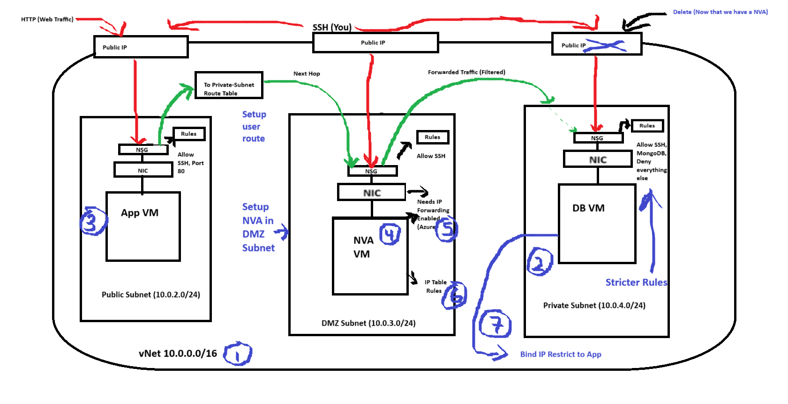
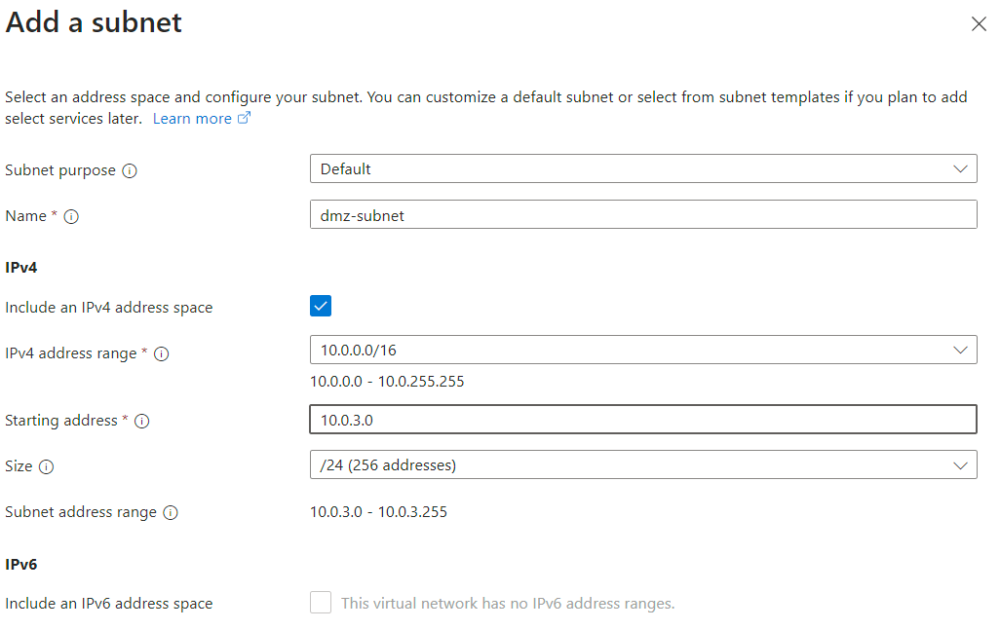
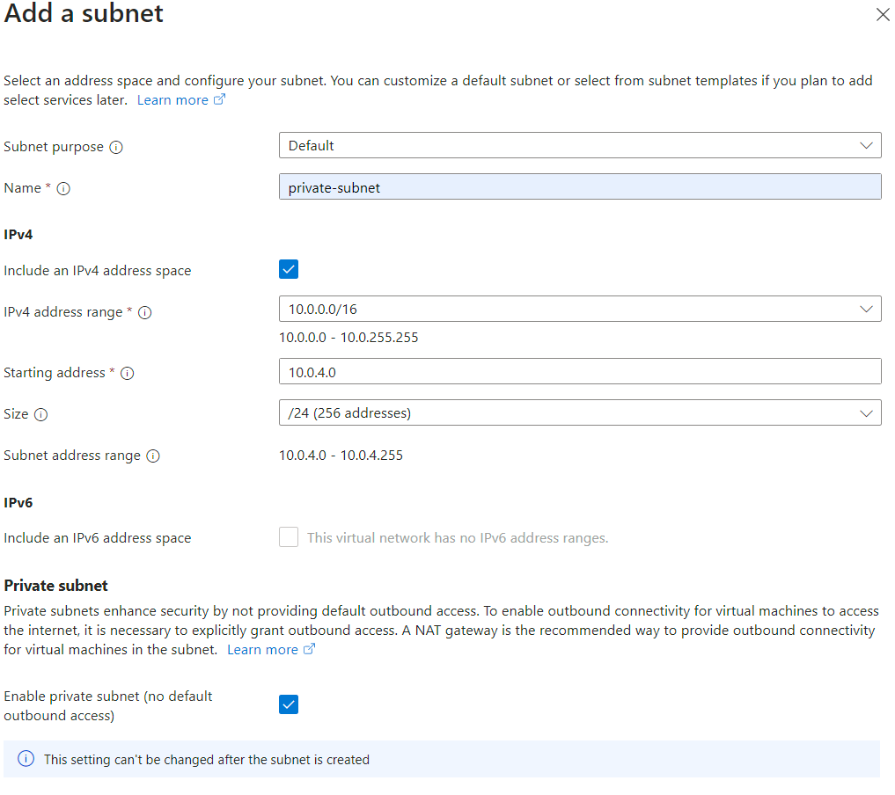
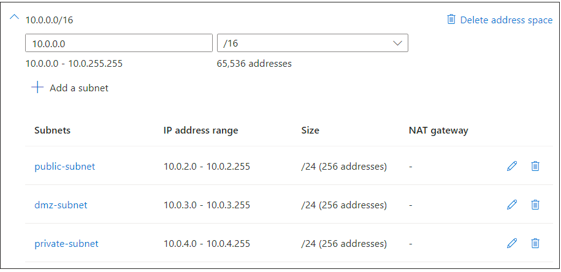
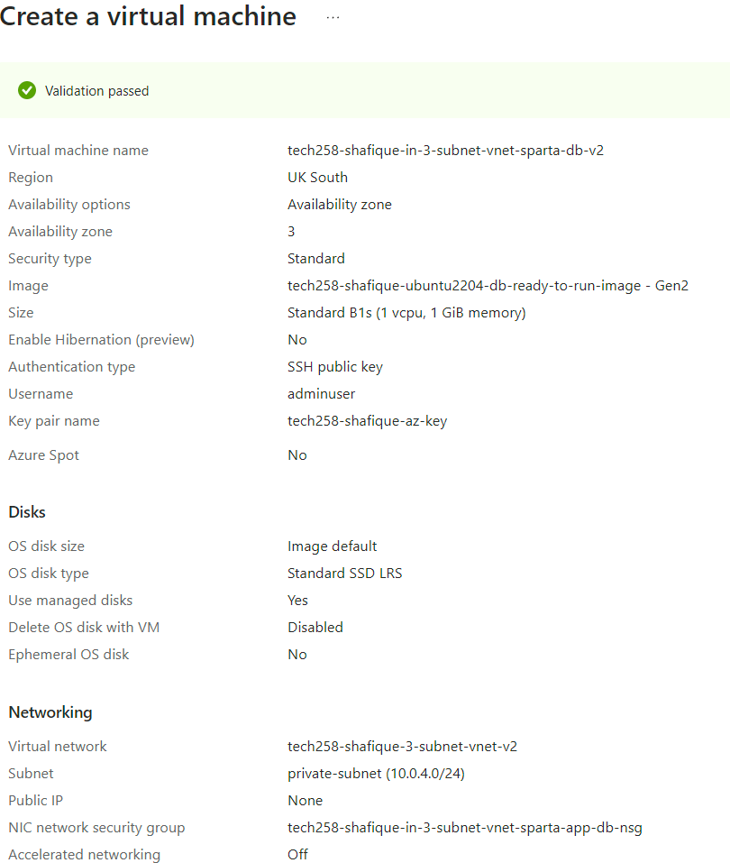
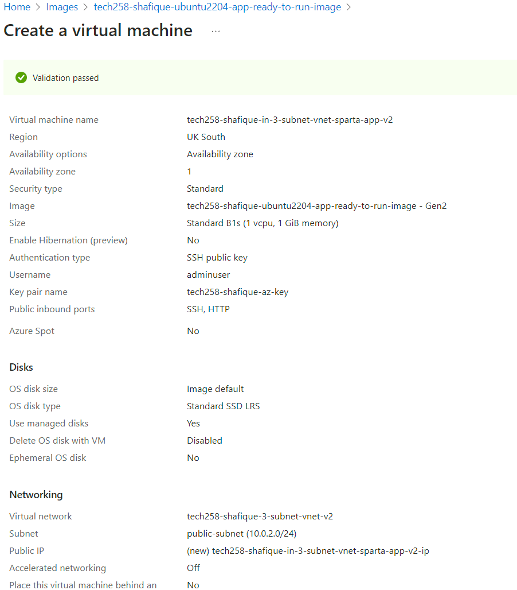
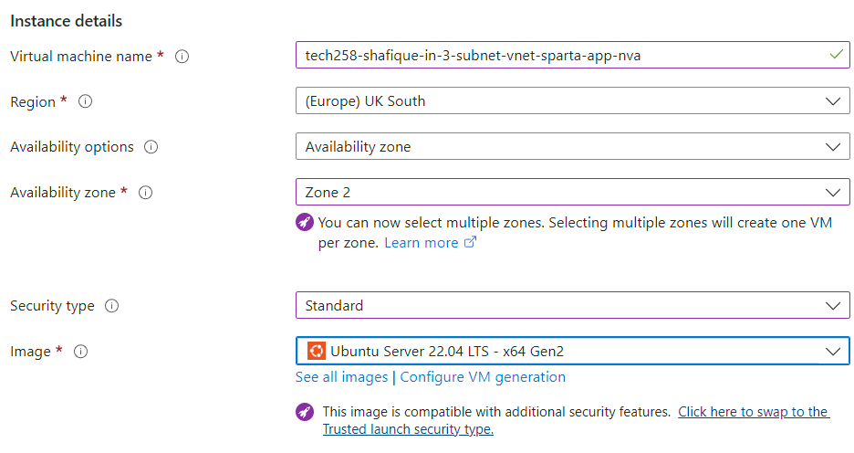
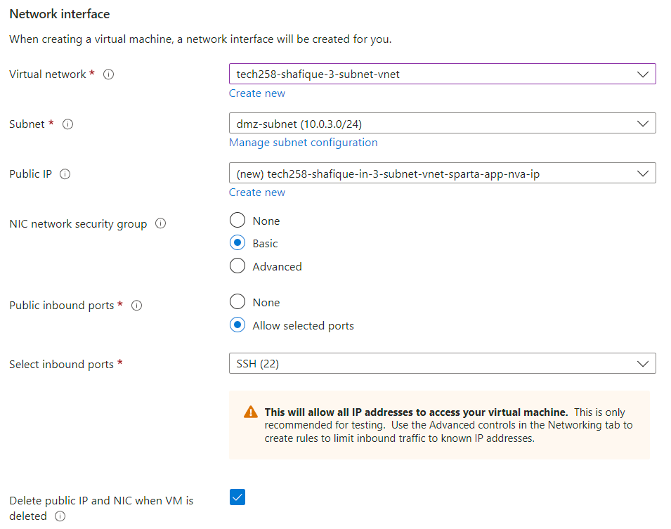
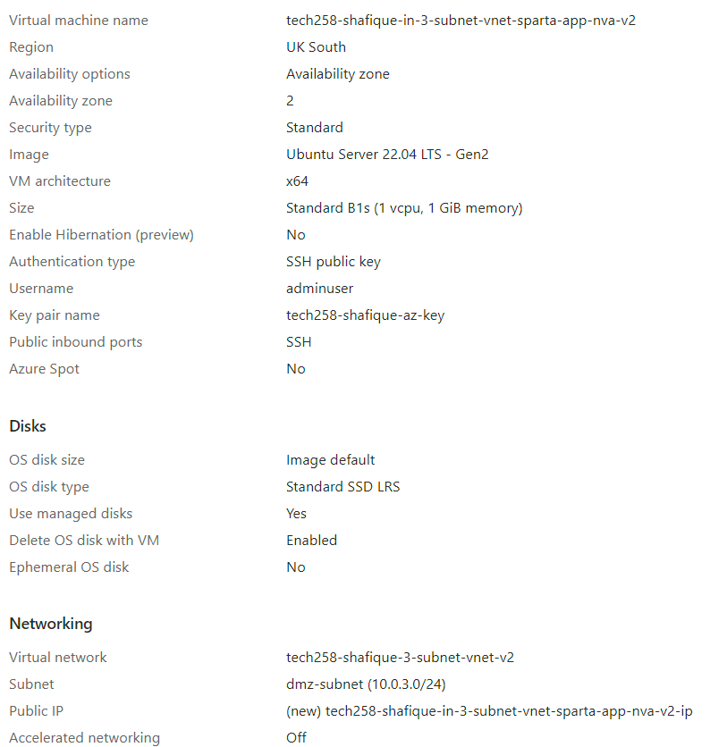

# Tech 258 - Network Virtual Appliance (NVA)

## What is a NVA?
An NVA is a network device that acts as a firewall, controlling traffic and letting through traffic it deems safe to our private subnet. On Azure, our NVA will be in the form of a Virtual Machine.

## Why do we want to add an NVA into our architecture?
We want to implement an NVA into our existing architecture as it adds another layer of security. Even though, NSGs have specific inbound rules to filter traffic we want a case where we can get rid of the public IP of resources that reside within our private subnets. If we therefore add a stopgap subnet (DMZ Subnet) with a NVA we can direct traffic through there instead, preventing the reach of our private subnet resources directly from outside of our VNet.

We can make a specific path that the traffic has to follow by leveraging route tables. We will use this route table to determine where network traffic is directed. In our case, it will be from our public subnet to our private subnet, using the DMZ subnet as a stopgap.

This can be visualised below where we have added a DMZ Subnet with a NVA VM acting as a firewall letting through the safe traffic (in green).

## Steps
 The Steps taken have been outlined in blue on the diagram above.

### Step 1 - Create a 3-Subnet VNet
We will need to create a new VNet as we are now adding a DMZ Subnet to our architecture. Plus, it is going to take our CIDR address block originally assigned to the Private Subnet in our 2-Subnet VNet.

For a general guide of creating a VNet go [here]()

Extra things to consider:
#### IP Addresses Section of configuration
1) Create a DMZ subnet. Example configuration:  

2) For private subnet tick `Enable private subnet (no default outbound access)` option. Example configuration:  

3) Once we have set up all of our subnets it should look something like this:  

### Step 2 - Setup DB VM
1) Look for previously made `db-ready-to-run` image. Click `Create VM` once on that image.
#### Key areas of configuration:
##### Basics section
- `Virtual machine name`: Enter a name that is easily identifiable e.g. `tech258-shafique-in-3-subnet-vnet-sparta-db-vm`
- `Availability Zone (Optional)`: To keep consistent with our architecture diagram, we'll deploy the DB VM in Zone 3 but this is optional.
- `Image`: Make sure you're using the correct image, if you go through the image itself this should automatically be filled.
- `Administrator Account`: Username should be adminuser and should use existing key stored in Azure.
- `Inbound Ports`: As it is our DB we only want SSH (22).
  
##### Disks section
- `OS Disk type`: Standard SSD (as we are only testing)

##### Networking section
- `Virtual Network`: Use our newly created 3-subnet VNet.
- `Subnet`: Our DB should go in our private subnet.
- **`Public IP (IMPORTANT)`**: Specify **NO** Public IP as we don't want direct traffic to our DB VM from outside sources.

##### Review + Create section
Our configuration should look something like this:  

### Step 3 - Setup App VM
1) Look for previously made `app-ready-to-run` image. Click `Create VM` once on that image.
#### Key areas of configuration:
##### Basics section
- `Virtual machine name`: Enter a name that is easily identifiable e.g. `tech258-shafique-in-3-subnet-vnet-sparta-app-vm`
- `Availability Zone (Optional)`: To keep consistent with our architecture diagram, we'll deploy the App VM in Zone 1 but this is optional.
- `Image`: Make sure you're using the correct image, if you go through the image itself this should automatically be filled.
- `Administrator Account`: Username should be adminuser and should use existing key stored in Azure.
- `Inbound Ports`: As it is our App we want SSH (22) and HTTP (80).
  
##### Disks section
- `OS Disk type`: Standard SSD (as we are only testing)

##### Networking section
- `Virtual Network`: Use our newly created 3-subnet VNet.
- `Subnet`: Our App should go in our public subnet.
- `Public IP`: Create a new IP as we want to access our app via the internet (HTTP Web Traffic).

##### Advanced section
- `User data`: Paste in our user data script that connects our App VM to our DB VM, as well as, kills and starts the app process again so our App is definitely running.

##### Review + Create section
Our configuration should look something like this:  

### Step 4 - Setup NVA VM
1) Look for previously made `app-ready-to-run` image. Click `Create VM` once on that image.
#### Key areas of configuration:
##### Basics section (Instance Details)
- `Virtual machine name`: Enter a name that is easily identifiable e.g. `tech258-shafique-in-3-subnet-vnet-sparta-app-nva`
- `Availability Zone (Optional)`: To keep consistent with our architecture diagram, we'll deploy the NVA VM in Zone 2 but this is optional.
- `Administrator Account`: Username should be adminuser and should use existing key stored in Azure.
- `Inbound Ports`: As it is our NVA we only want SSH (22).

Example Instance Details section:  

  
##### Disks section
- `OS Disk type`: Standard SSD (as we are only testing)

##### Networking section
- `Virtual Network`: Use our newly created 3-subnet VNet.
- `Subnet`: Our NVA should go in our DMZ subnet.
- `Public IP`: Create a new IP as we want to SSH into our NVA VM for a later step (IP-Forwarding/IP Rules Table).

Example Networking section:  

##### Review + Create section
Our configuration should look something like this:  

### Step 5 - Enable IP-Forwarding on Azure (NIC) + NVA VM

### Step 6 - Create IP Rules Table

### Step 7 - Restrict Bind IP to App VM only