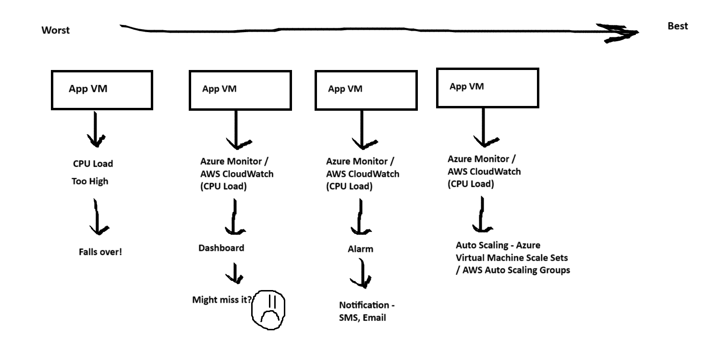
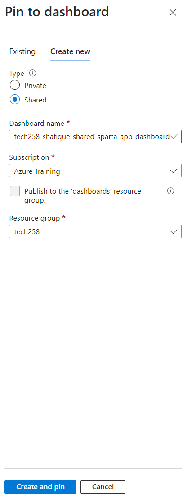
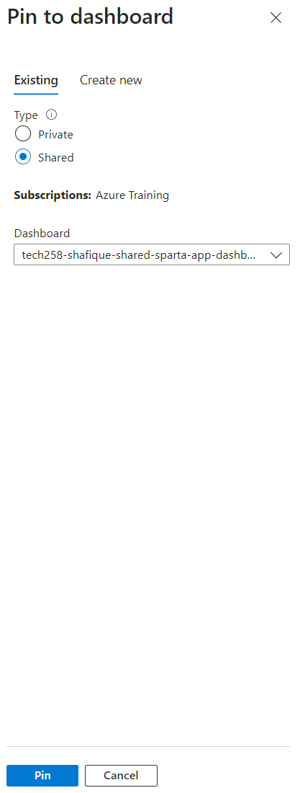
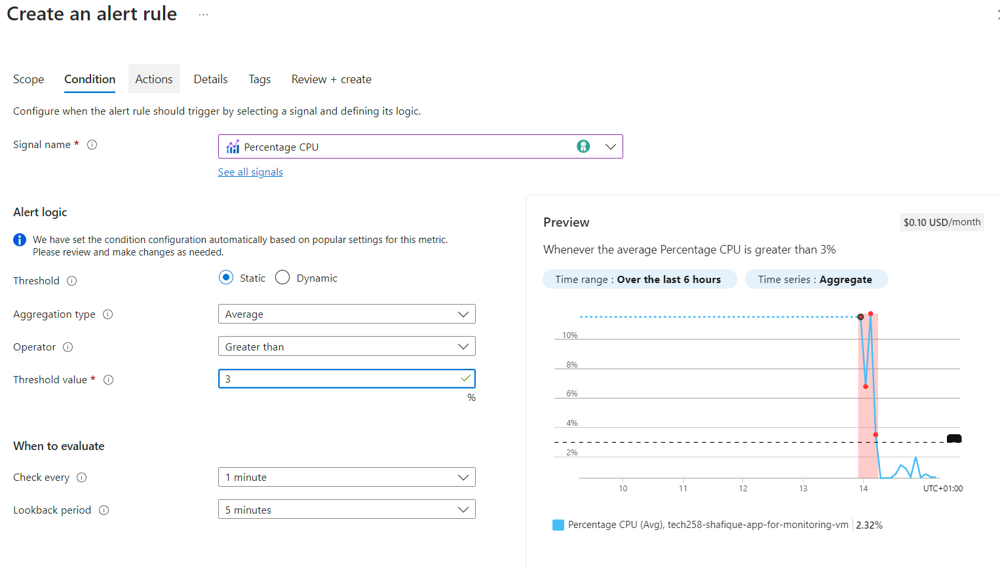
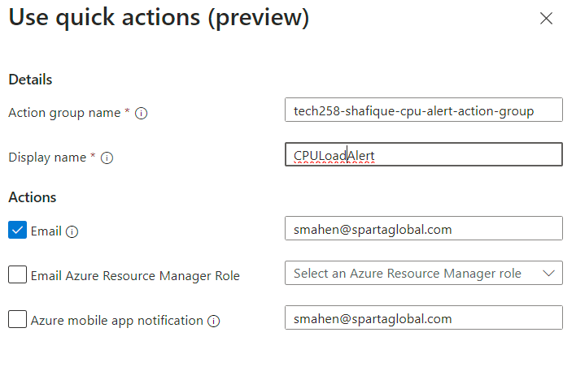
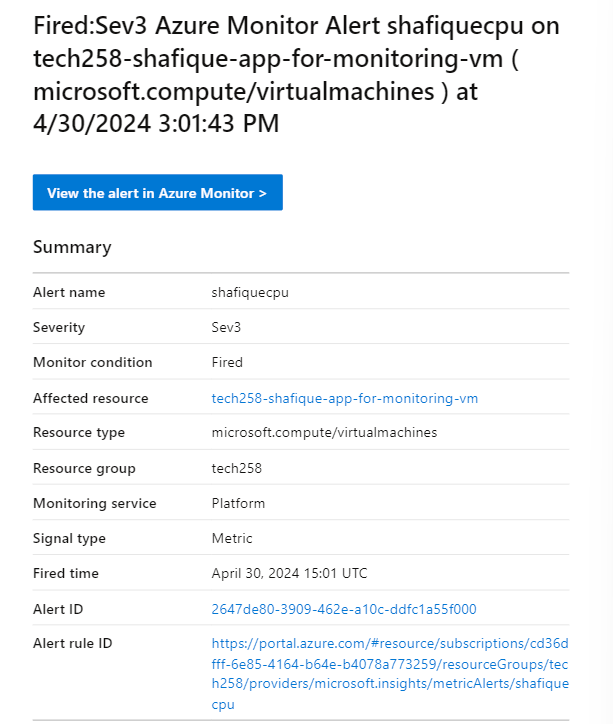
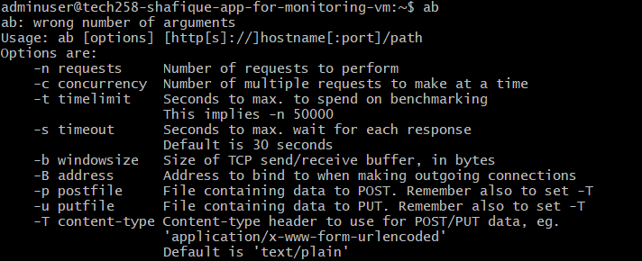

# Tech 258 - Monitoring, Alert Management & Auto-Scaling

## Monitoring

### Why do we want to Monitor our Architecture?
We want to implement a monitoring solution into our architecture to mitigate the effect of human error and the time lag that comes with it in terms of adapting to the current problem posed to our architecture at hand. For example, if the CPU load is too high if left to us, we may miss this as we may not be actively monitoring our VM.

We can therefore automate monitoring through the use of tools and services available on AWS/Azure. (Azure Monitor & AWS CloudWatch)



### Setting up our Monitoring Dashboard
On our VM `Overview`, we can scroll down to see default metrics that are automatically monitored by Azure. We can pin these (icon on the top right) to a custom dashboard we can create. Example: <br>


We can also add to our previously created dashboard. Example: <br>


## Alert Management

### How do we set up an Alert on Azure?
To set an Alert on Azure follow these steps:
1) Go to the `Alerts` section on Azure Portal
2) Configure your `Alert Rule`. Example: <br>

3) Configre your `Action Group` (who do you want to be notified?) using `Quick Actions`. Example: <br>

4) `Review + Create` when ready

### How do we get notified?
We can set Alerts that will notify us when a particular metric has passed a set threshold. For example, Maximum CPU Load > 3%. We can make AWS/Azure automatically send us this notification via SMS or Email. Example email: <br>



## Load Testing - Apache Bench

### Installing Apache Bench
Apache Bench is a tool we can install on our VMs that we can use to load test. We can set a website and fire requests at this website to do this. In our case, we would use our server as the target.

To install Apache Bench run the command:
```
sudo apt-get install apache2-utils
```

Check the install using the command:
```
ab
```
The output should look similar to the following: <br>


#### Running Apache Bench
We want to spike our CPU to get an idea of what threshold to set for our alarm. We need to get the public IP of our App VM. Then we can do this using the following command:
```
ab -n 1000 -c 100 http://20.90.163.118/
```
`-n` - Total Number of Requests. <br>
`-c` - Speed of requests being sent.

If the initial test maybe wasn't enough to spike the CPU we could run further tests until we reach what we desire from our testing. 

This would be in our case as our Sparta App is very simple and doesn't consume much of the CPU.

Example tests: <br>
```
ab -n 10000 -c 200 http://<app VM's IP address>/
ab -n 20000 -c 300 http://<app VM's IP address>/
ab -n 40000 -c 300 http://<app VM's IP address>/
```

### Understanding the Results
After running the command you would get an output like this:


The main points to understand would be the longest request (100%) and 50% of requests time to gauge where to set our threshold.

## Scaling Out/In vs Scaling Up/Down
These are two different approaches to scaling that sound similar but are completely different.

### Scaling Out/In
This process also known as *Horizontal Scaling*. In this case, dependent on our alarms we would increase (out) the amount or reduce (in) the amount of instances we may have.

### Scaling Up/Down
This process is also known as *Vertical Scaling*. In this case, dependent on our alarms we would increase (up) the size/processing power/etc or reduce (down) the size/processing power/etc of our instances.


