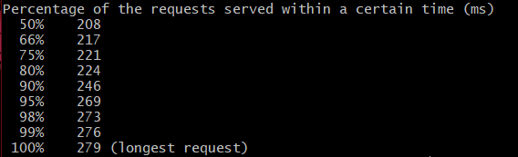
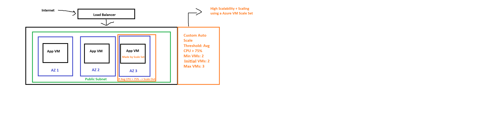
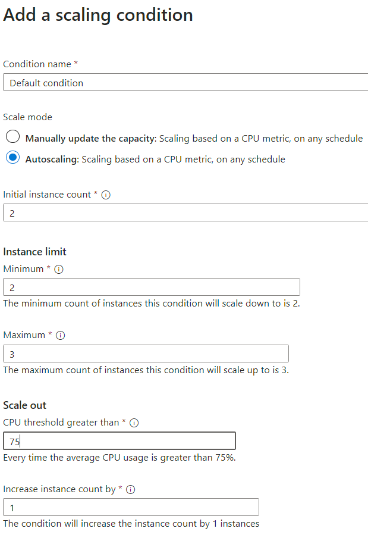
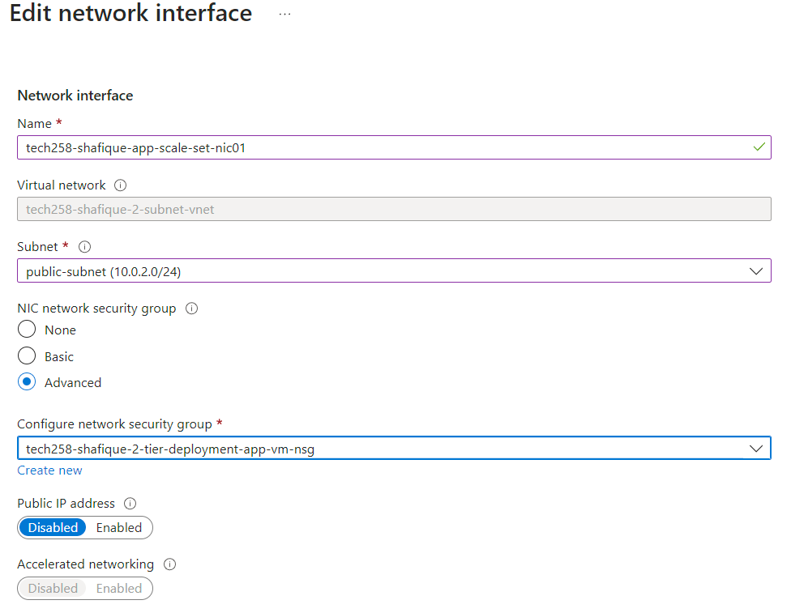
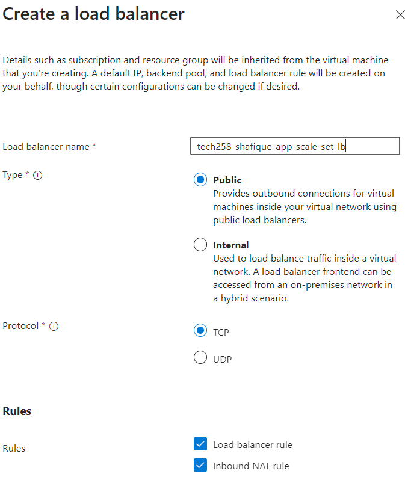
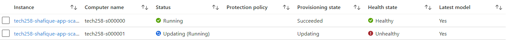
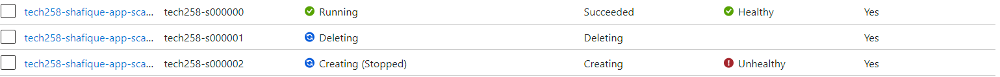
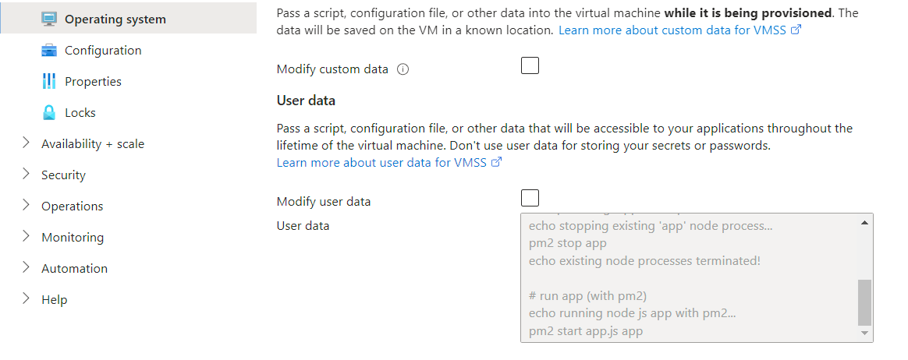
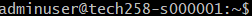

# Tech 258 - Monitoring, Alert Management & Auto-Scaling

- [Tech 258 - Monitoring, Alert Management \& Auto-Scaling](#tech-258---monitoring-alert-management--auto-scaling)
  - [Monitoring](#monitoring)
    - [Why do we want to Monitor our Architecture?](#why-do-we-want-to-monitor-our-architecture)
    - [Setting up our Monitoring Dashboard](#setting-up-our-monitoring-dashboard)
  - [Alert Management](#alert-management)
    - [How do we set up an Alert on Azure?](#how-do-we-set-up-an-alert-on-azure)
    - [How do we get notified?](#how-do-we-get-notified)
  - [Load Testing - Apache Bench](#load-testing---apache-bench)
    - [Installing Apache Bench](#installing-apache-bench)
      - [Running Apache Bench](#running-apache-bench)
    - [Understanding the Results](#understanding-the-results)
  - [Auto Scaling](#auto-scaling)
    - [Scaling Approaches](#scaling-approaches)
      - [Scaling Out/In vs Scaling Up/Down](#scaling-outin-vs-scaling-updown)
      - [Scaling Out/In](#scaling-outin)
      - [Scaling Up/Down](#scaling-updown)
    - [High Availability + Scalability using a Azure VM Scale Set](#high-availability--scalability-using-a-azure-vm-scale-set)
      - [Load Balancer](#load-balancer)
      - [Summary](#summary)
    - [Setting up our Scale Set](#setting-up-our-scale-set)
      - [Prerequisites](#prerequisites)
      - [Steps](#steps)
      - [Cleaning up - Order](#cleaning-up---order)
    - [Troubleshooting](#troubleshooting)
      - [Case: Load Balancer - Creating an Unhealthy Instance](#case-load-balancer---creating-an-unhealthy-instance)
        - [Why does this work?](#why-does-this-work)
        - [Does the Load Balancer do it's job?](#does-the-load-balancer-do-its-job)
      - [Case: 502 Bad Gateway](#case-502-bad-gateway)
      - [Case: Trying to SSH into our VMs](#case-trying-to-ssh-into-our-vms)


## Monitoring

### Why do we want to Monitor our Architecture?
We want to implement a monitoring solution into our architecture to mitigate the effect of human error and the time lag that comes with it in terms of adapting to the current problem posed to our architecture at hand. For example, if the CPU load is too high if left to us, we may miss this as we may not be actively monitoring our VM.

We can therefore automate monitoring through the use of tools and services available on AWS/Azure. (Azure Monitor & AWS CloudWatch)


### Setting up our Monitoring Dashboard
On our VM `Overview`, we can scroll down to see default metrics that are automatically monitored by Azure. We can pin these (icon on the top right) to a custom dashboard we can create. Example: <br>


We can also add to our previously created dashboard. Example: <br>


## Alert Management

### How do we set up an Alert on Azure?
To set an Alert on Azure follow these steps:
1) Go to the `Alerts` section on Azure Portal
2) Configure your `Alert Rule`. Example: <br>

3) Configre your `Action Group` (who do you want to be notified?) using `Quick Actions`. Example: <br>

4) `Review + Create` when ready

### How do we get notified?
We can set Alerts that will notify us when a particular metric has passed a set threshold. For example, Maximum CPU Load > 3%. We can make AWS/Azure automatically send us this notification via SMS or Email. Example email: <br>


## Load Testing - Apache Bench

### Installing Apache Bench
Apache Bench is a tool we can install on our VMs that we can use to load test. We can set a website and fire requests at this website to do this. In our case, we would use our server as the target.

To install Apache Bench run the command:
```
sudo apt-get install apache2-utils
```

Check the install using the command:
```
ab
```
The output should look similar to the following: <br>


#### Running Apache Bench
We want to spike our CPU to get an idea of what threshold to set for our alarm. We need to get the public IP of our App VM. Then we can do this using the following command:
```
ab -n 1000 -c 100 http://20.90.163.118/
```
`-n` - Total Number of Requests. <br>
`-c` - Speed of requests being sent.

If the initial test maybe wasn't enough to spike the CPU we could run further tests until we reach what we desire from our testing. 

This would be in our case as our Sparta App is very simple and doesn't consume much of the CPU.

Example tests: <br>
```
ab -n 10000 -c 200 http://<app VM's IP address>/
ab -n 20000 -c 300 http://<app VM's IP address>/
ab -n 40000 -c 300 http://<app VM's IP address>/
```

### Understanding the Results
After running the command you would get an output like this: <br>


The main points to understand would be the longest request (100%) and 50% of requests time to gauge where to set our threshold, so in our case it took 208ms on average to serve 50% of the requests tested.

## Auto Scaling

### Scaling Approaches

#### Scaling Out/In vs Scaling Up/Down
These are two different approaches to scaling that sound similar but are completely different.

#### Scaling Out/In
This process also known as *Horizontal Scaling*. In this case, dependent on our alarms we would increase (out) the amount or reduce (in) the amount of instances we may have.

#### Scaling Up/Down
This process is also known as *Vertical Scaling*. In this case, dependent on our alarms we would increase (up) the size/processing power/etc or reduce (down) the size/processing power/etc of our instances.

### High Availability + Scalability using a Azure VM Scale Set
We can automate scaling of our virtual machines by using Azure VM Scale sets. By setting a threshold, e.g. 75% Avg CPU usage, we can automatically scale out our infrastructure when necessary. Once this threshold is no longer met, the scale set can also scale in our number of virtual machines.

To do put this in place use the following parameters:
- `Threshold`: What condition will need to be met for scaling to trigger?
- `Min`: Minimum number of VMs
- `Initial`: Default number of VMs, we would normally have two so we can have a backup VM by default.
- `Max`: Maximum number of VMs

#### Load Balancer
A load balancer is essential to our highly available + scalable solution in many ways:
- **Load Distribution**: Our load balancer's primary purpose is to uniformly balance the incoming traffic across our app machine infrastructure. This will help mitigate the chance of our App CPU's from spiking i.e. disrupting our service.
- **Security**: We can now use the Load Balancer to handle traffic that originates from outside of our network, rather than directly using the public IP addresses of our app VMs.
- **Health Checks**: We can configure our load balancer to monitor the health of our machines. If it doesn't receive an OK status code for a length longer than our grace period specified, we can configure the load balancer to automatically delete and recreate another instance of our machines.
- **Manoeuvrability**: As the load balancer attaches onto our scale set, it gives us the flexibility to move it around to different sets if necessary.

#### Summary
High Availability: 
- VMs deployed over multiple AZ's
- We have a backup VM (by default and number of VMs will stay within Min/Max range)

Scalability:
- VMs created/remove when our `Scale out` and `Scale in` thresholds are met respectively.

The scale set will keep this range in mind to smartly manage our infrastructure!



### Setting up our Scale Set

#### Prerequisites
Before we can set up a scale set, we need to be absolutely certain that we have images that are configured correctly and run our application correctly.

#### Steps
1) Go to the `Virtual Machine scale sets` section on the Azure Portal.
2) Click `Create` to start the creation process.
3) Fill in the `Basics` section: Key areas:
   
   - `Virtual machine scale set name`: Give the scale set a name to easily identify what it is/what it does.
   - `Availability Zone`: As we want our solution to be highly available, we will check every zone (1, 2 & 3).
   - `Orchestration mode`: We only want to achieve horizontal scalability (out/in) so choose `Uniform`.
   - `Scaling mode`: As we are using a CPU metric choose `Autoscaling`. Configure your `scaling configuration`. Example configuration: <br>
   
   - `Image`: Use our ready-to-run app image.
   - `Administrator Account`: Use our stored Azure key.
4) For the `Disks` section, as it is a test make sure the `OS Disk type` is set to Standard SSD.
5) Fill in the `Networking` section: Key areas:

   - `Virtual Network`: Use our pre-made 2-subnet vnet.
   - `Network interface`: Edit the default. Example: <br>
   
   - `Select a load balancer`: Create a new load balancer here. Example configuration: <br>
   
6) For the `Health` section, tick the `Enable application health monitoring` and `Enable automatic repairs` boxes.
7) For the `Advanced` section, add the `User Data` that will kill/start our app process to get the app running. 
8) Add relevant `Tags`.
9) `Review + Create` when ready!

#### Cleaning up - Order
1) Delete the Scale Set itself
2) Delete Load Balancer
3) Delete Public IP address of Load Balancer

### Troubleshooting

#### Case: Load Balancer - Creating an Unhealthy Instance
We can create an unhealthy instance for testing purposes, like testing if our Load Balancer works automatically. We can do this by:
1) `Stop` the instance.
2) `Start` the instance.

##### Why does this work?
We used `User Data` to start running our application. If we were to restart our instance, this `User Data` isn't run again so the app is no longer running on that particular machine.

Therefore, when the Load Balancer tries to connect to it, it will not receive a status code of 200 and will therefore mark it's `Health State` as `Unhealthy`. Example: <br>


##### Does the Load Balancer do it's job?
After the grace period has expired, the load balancer should automatically get rid of this `Unhealthy` instance and replace it with a new instance. Example: <br>


As you can see, the Load Balancer has started to delete the faulty machine and has started creating a new machine to take its place. It is currently marked as `Unhealthy` as it isn't fully configured/up and running yet!

#### Case: 502 Bad Gateway
In this case, our application isn't running correctly. There are some checks we can do:
1) Make sure we have used the right image/an image that had been tested separately i.e. is ready to run.
2) Check if our VM states are `Healthy`.
3) Our `User Data` could have a mistake. We could address this by:
   - Go to `Settings > Operating System`
   - Check your `User Data` and modify if necessary. Example: <br>
   
   - `Reimage` your instances to restore them to initial state.
   - `Upgrade` your instances to bring them to the latest versions (utilise modified user data).

#### Case: Trying to SSH into our VMs
As we have removed the public IPs of our VMs, we can no longer reach them outside of the network directly. All the traffic is handled by the Load Balancer. Therefore, we must update our SSH command to take this into consideration. Example:
```
ssh -i ~/.ssh/<azure_key> -p <start of NAT range> <user>@<public_IP_of_LB>
```

Breaking the command down: <br>
`-i` - Use private key file stored locally. <br>
`-p` - Specify port that the LB is listening to that specifically redirects to Port 22 (SSH) in the Backend.

**Note:** If we want to connect to our second instance, reflect this in the `-p` flag e.g. if our range starts at `50000`, we have to use port `50001` to connect to our second machine.

If everything goes well you should have established a remote connection through SSH: <br>


In this case we have connected to our second machine shown by the name of the machine being `tech258-s000001`.


