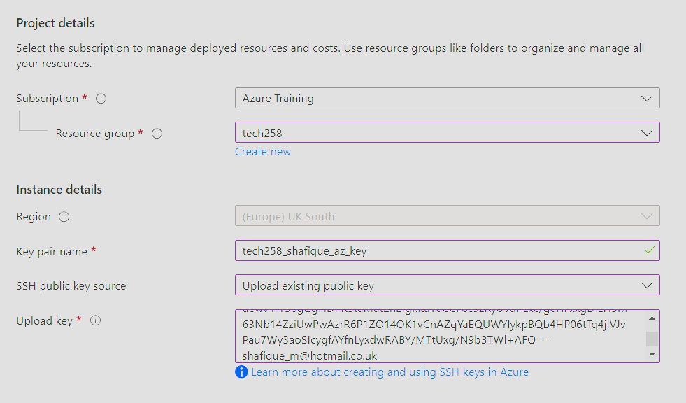
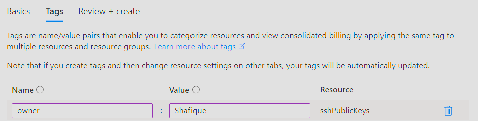
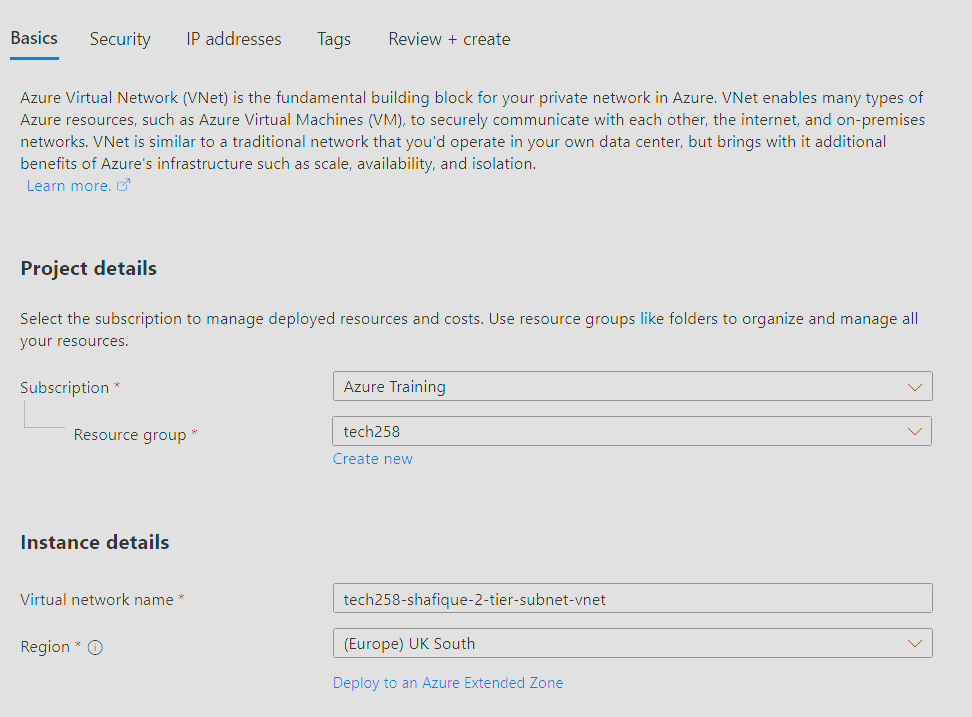
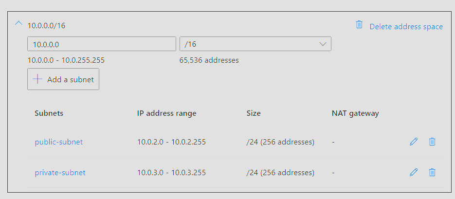
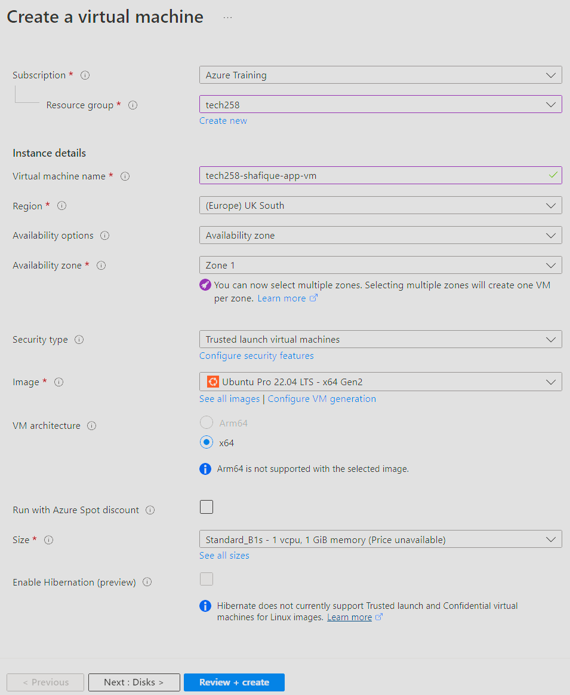
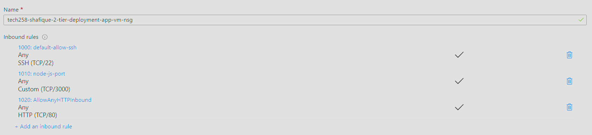

# Tech 258 - Azure 2-Tier Deployment

## Step 1 - Generating SSH Key Pair
In our case, we would like to generate our own key pair for Azure. To do this, we would go onto our Git Bash and generate the key pair using the `SSH-keygen` command: <br>
Example usage:
```
ssh-keygen -t rsa -b 4096 -C "<YOUR_EMAIL>"
```

## Step 2 - Putting our Public Key on Azure
To do this there are some steps we have to follow:
1) Go to the Azure Portal: `portal.azure.com`
2) Search for the `SSH Keys` section
3) Click `Create`
4) Configure key in `Basics` tab. Example configuration: <br>

5) Configure tags in `Tags` tab. Example configuration: <br>

6) When ready `Review + Create` your SSH key configuration.

## Step 3 - Create VNet for our deployment
To do this there are some steps we have to follow:
1) Search for the `Virtual networks` section
2) Click `Create`
3) Configure VNet in `Basics` tab. Example configuration: <br>

4) Configure IP address space in `IP addresses` tab: <br>

5) Configure tags in `Tags` tab. Example configuration: <br>

6) When ready `Review + Create` your VNet configuration.

## Step 4 - Create VM for our services
To do this there are some steps we have to follow:
1) Search for the `Virtual machine` section
2) Click `Create`
3) Configure VM in `Basics` tab. Example configuration: <br>

4) Change `OS Disk Type` to `Standard SSD` in `Disks` tab.
5) Use our created VNet in `Networking` tab.
6) Configure your Network Security Group here also. Example configuration: <br>
 
7) Configure tags in `Tags` tab. Example configuration: <br>

8) When ready `Review + Create` your VM configuration.

## Step 5 - SSH into VM
Now that we have created our VM's we can now connect to them remotely using SSH. The command we will use will look like this: <br>
```
ssh -i <~/.ssh/private_key_name> adminuser@<vm_private_ip_address>
```

## Step 6 - Setup VM
Just like we have done before on AWS, we would now run our scripts to setup our VMs and connect both tiers of our deployment. To see more information on this refer to the other .md files: [App Deployment](https://github.com/ShafiqueMahen2/tech258_cloud/blob/main/2-tier-deployment/deploying_app.md) & [DB Deployment + Connection](https://github.com/ShafiqueMahen2/tech258_cloud/blob/main/2-tier-deployment/deploying_db.md)

## What makes AWS and Azure different?
In our Azure deployment we had to configure a VNet to deploy our resources in whereas in AWS public and private subnets are automatically created when creating our VPC. As we don't use a VPC in Azure, that is why we would have to create our own VNet so that our resources can connect with each other in the same network.

Also, configuring security groups in Azure & AWS are slightly different. In AWS, the console is more user friendly and straight forward to accomplish this task whereas in Azure you would have to find the `Advanced` settings option when configuring your VM on the `Network Security Group` section and configure your custom security group there before adding it to your VM configuration.

## Why do we not have to specify MongoDB's port?
By default, when you first create a security group, one of the default rules is to allow any internal traffic, on any port, within your VNet. All devices on the inside of your VNet can communicate with each other, even if they're in separate subnets. 

This is another reason why Azure is different as you have to manually open up the port on AWS. Internal traffic isn't allowed on every port by default on AWS.

## What happens if we specify the Public IP of our DB VM on DB_HOST?

It is still possible to connect both tiers this way but it doesn't make much sense from a security perspective. By using the public IP, we would have to set up the DB port on the DB VM manually i.e open the inbound port 27017 (MongoDB) on the DB VM. This is because we are now directing our traffic from outside of the VNet; it's like going outside the apartment and going back in to enter the DB VM 'room', whereas if we were to use the Private IP we are simply traversing the secure apartment.

