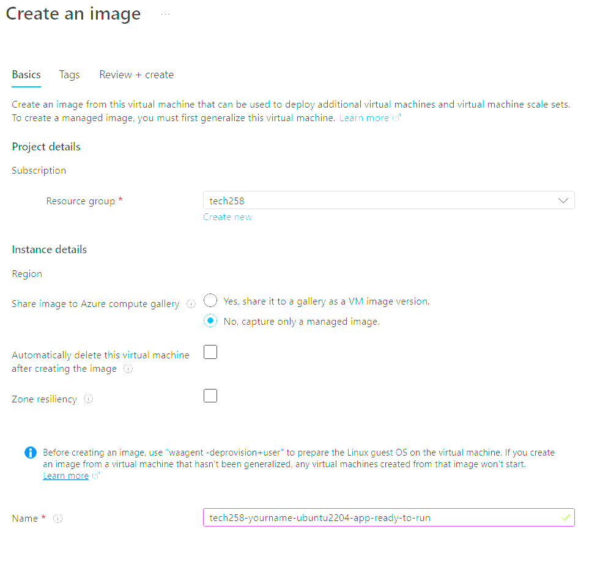

# Tech 258 - Using User Data & Images

## User Data
To speed up our deployment even more, instead of needing to SSH into our instance to run our scripts we can bootstrap our virtual machines with the script that will execute once the virtual machine resource is ready.

To do this we make use of the `User data` component of our setup.

Refer to the README for a general overview of how to deploy your virtual machines [here.](https://github.com/ShafiqueMahen2/tech258_cloud/blob/main/2-tier-deployment/2-tier-deployment-azure/readme.md)

When reaching the `Advanced` tab, look for the `User data` section and tick `Enable user data`.Paste your corresponding script there. Example configuration: <br>


## Images
Now that we have finished creating and configuring our VM, we can `Capture` that state to use in future for even quicker deployment. We can do this by creating an image! To do this follow these steps:

1) SSH into the VM and generalise the VM. This will wipe the users so make sure you do this when ready as you won't be able to recover that data. To do this run the following command:
```
sudo waagent -deprovision+user
```
2) On our VM `Overview` page, click the `Capture` option
3) Enter the correct details. Make sure you select `No, capture only a managed image`. Example configuration: <br>

4) An alternative way will be selecting the `Yes, share it to a gallery as a VM image version.` option, extra steps will be taken like defining a image. Example configuration: <br>

5) `Review + Create` when ready.

## Troubleshooting our deployment
If there is a case where we use the user data to bootstrap our configurations and our deployment doesn't work there are some things we can check.

### Case: App doesn't deploy automatically
If this is the case, we may have to SSH manually and run the script manually. There are some things to look out for:

1) **Permissions**: As we have cloned the repo into our root directory, if we haven't taken into account that for our path when we use the `cd` command, we may have to adjust that in our script. To recover from this we may have to give `adminuser` the right permissions. Three ways are:
- `chmod -r` - Give read/write/execute permissions recursively.
- `chown -r` - Make `adminuser` owner of app dir and all of it's contents (recursive).
- `sudo -E` - Grants us root user privilege for the command. Use `-E` to preserve environment variables.

2) **Temporary Root Login**: If the `sudo` method doesn't work, this will be our last resort. We would temporarily login as the root user to gain access to the app dir.