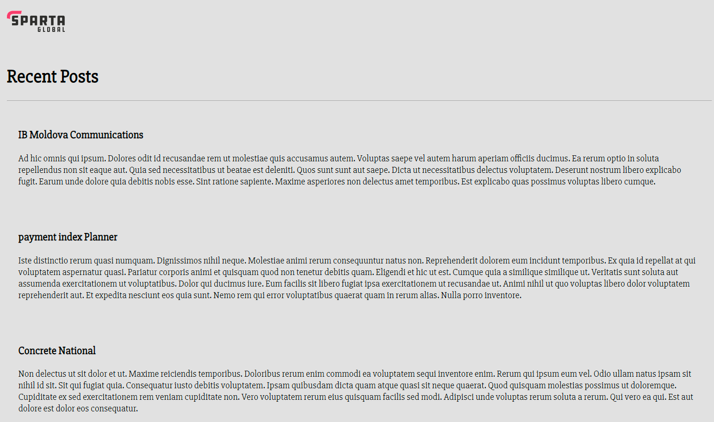

# Tech 258 - Deploying Sparta Test DB

- [Tech 258 - Deploying Sparta Test DB](#tech-258---deploying-sparta-test-db)
  - [Step 1 - Create a MongoDB instance](#step-1---create-a-mongodb-instance)
  - [Step 2 - Update \& Upgrade packages](#step-2---update--upgrade-packages)
  - [Step 3 - Install gnupg \& curl packages](#step-3---install-gnupg--curl-packages)
  - [Step 4 - Downloading the MongoDB GPG Key](#step-4---downloading-the-mongodb-gpg-key)
  - [Step 5 - Creating a list file for MongoDB](#step-5---creating-a-list-file-for-mongodb)
  - [Step 6 - Installing MongoDB](#step-6---installing-mongodb)
  - [Step 7 - Configure BindIP](#step-7---configure-bindip)
  - [Step 8 - Restart \& Enable MongoDB](#step-8---restart--enable-mongodb)
  - [Step 9 - Connecting App and DB instances](#step-9---connecting-app-and-db-instances)


## Step 1 - Create a MongoDB instance
Using the AWS console, we can create another EC2 instance which will hold our MongoDB DB for our application. Once we have configured this database, we will then establish a connection with our App EC2 instance.

When creating this instance, make sure to allow the following ports via Security Group Inbound Rules:

- `SSH` (Port 22): Make sure this connection can be established anywhere (0.0.0.0)
- `MongoDB` (Port 27017): We will have to create a custom TCP with the port range specified for MongoDB connections. Make sure this connection can be established anywhere (0.0.0.0)

## Step 2 - Update & Upgrade packages
Likewise for the app instance, we will run these commands to refresh our local package database using the `update` command, then move over to the latest versions of these packages using the `upgrade` command. Example usage: <br>
```
sudo apt update -y
sudo apt upgrade -y
```

## Step 3 - Install gnupg & curl packages
The previous step should install these packages for us but just in the case where these packages haven't been installed, we will add an extra step to explicitly install these packages. These packages will be needed for when we want to install MongoDB and it's dependencies. Example usage: <br>
```
sudo apt-get install gnupg curl -y
```

## Step 4 - Downloading the MongoDB GPG Key
This key is installed so we can use it to verify MongoDB packages that we install later on.
Example usage: <br>
```
curl -fsSL https://www.mongodb.org/static/pgp/server-7.0.asc | \
   sudo gpg -o /usr/share/keyrings/mongodb-server-7.0.gpg \
   --dearmor
```

## Step 5 - Creating a list file for MongoDB
We then create a list file for MongoDB to provide a convenient way for package managers, like `apt`, to manage MongoDB installations. Example usage: <br>
```
echo "deb [ arch=amd64,arm64 signed-by=/usr/share/keyrings/mongodb-server-7.0.gpg ] https://repo.mongodb.org/apt/ubuntu jammy/mongodb-org/7.0 multiverse" | sudo tee /etc/apt/sources.list.d/mongodb-org-7.0.list
```

## Step 6 - Installing MongoDB
We will now install MongoDB and it's corresponding packages. In our case we would like to specify the version of MongoDB, as we don't want the latest version we require version `7.0.6` for this application. Example usage: <br>
```
sudo DEBIAN_FRONTEND=noninteractive apt-get install -y mongodb-org=7.0.6 mongodb-org-database=7.0.6 mongodb-org-server=7.0.6 mongodb-mongosh=2.2.4 mongodb-org-mongos=7.0.6 mongodb-org-tools=7.0.6
```

## Step 7 - Configure BindIP
We must now make it so MongoDB will allow connections from anywhere (0.0.0.0). To do this, we must edit the value stored for the variable `bindIp` in the MongoDB configuration file, located at the path `/etc/mongod.conf`. We can use the `sed` command to find and replace this value. Example usage: <br>
```
sudo sed -i 's/bindIp: 127.0.0.1/bindIp: 0.0.0.0/' /etc/mongod.conf
```

We use the `-i` flag to edit and save the changes in-place.

## Step 8 - Restart & Enable MongoDB
As we have made changes to our MongoDB configuration file, we will `restart` the service to make sure these changes are active. We will also `enable` the MongoDB service, so that if we were to reboot our instance, for example, the MongoDB service will be running at boot up. Example usage: <br>
```
sudo systemctl restart mongod
sudo systemctl enable mongod
```

## Step 9 - Connecting App and DB instances

In order to connect the App instance to the DB instance we must do the following:

1) SSH into our Application instance.
2) Create an environmental variable `DB_HOST` which will hold the connection string which will allow for a connection between the App and DB instances. Example usage: <br>
```
export DB_HOST=mongodb://<db_instance_private_ip>/posts
```
3) Change into our `app` repository
4) Run `npm install`
5) Run `npm start`

These commands should re-run our `app` process, using the connection string stored in the variable `DB_HOST`, which will then seed our database during the `npm install` process. If everything went well, if we were to go to the `/posts` path on our browser we should be greeted with a page like this: Example path: <br>
`<app_instance_public_ip>:3000/posts>`




