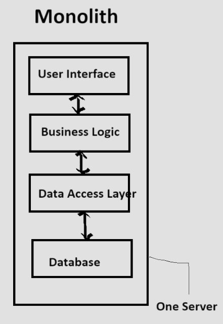
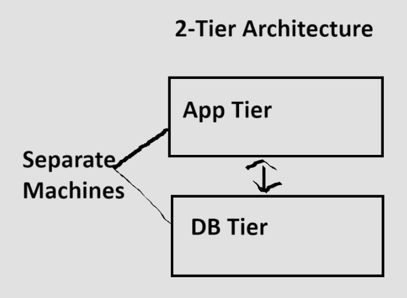

# Tech 258 - Monolith vs 2-Tier Architecture
## What is Monolith?
Monolith, also known as Monolithic Architecture, is an software engineering approach where all parts of the software are packaged together and unified within a single server.

### Advantages
- **Makes the application independent**: Every component is accessible over the same server.
- **Makes development simple**: Fewer moving parts.
- **Quicker to get to market**: Teams can rapidly pull together and build an executable app using a monolithic system.

### Disadvantages
- **Less scalability**: As the software is tightly coupled, if we were to expand we would have to consider every service.
- **Security risks**: If a outside source gets access to our application, every service may be exposed.
- **High dependencies between services**: If for example our data access layer goes down, we may lose access to our database.

## What is 2-Tier Architecture
2-Tier Architecture is a software engineering approach where we separate our application components onto 2 different machines. In our case we have an `Application Tier` and a `Database Tier`.

### Advantages
- **Simpler to manage and control**: Less layers to handle and oversee.
- **Improved system performance**: Direct interaction between layers speeds up data processing and retrieval.
- **Cost-effective**: Less layers means less resource and time investment.

### Disadvantages
- **Limited scalability**: Tight coupling between these two layers.
- **Not ideal for large systems**: Monolithic may be a better approach when incorporating more components.

