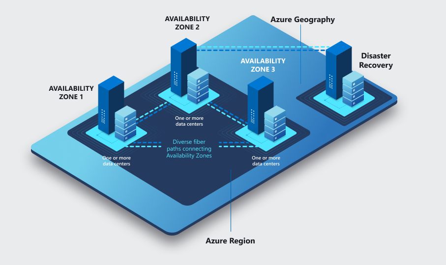

# Tech 258 - Azure

## The Basics of Azure

Azure is a cloud computing platform and service offered by Microsoft. It offers a wide range of cloud services, including computing, storage, databases and more. Users can build, deploy and manage these applications through Microsoft's data centers that are distributed globally.

## Azure Regions and Availability Zones

### Regions
- These are geographical areas where Microsoft has it's data centers. 
- Each region is composed of one or more of these data centers and they will be in close proximity to one another. 
- Regions are independent, and data within a region stays within that region by default.

### Availability Zones
- These zones are unique physical locations within an Azure region.
- Each zone is made up of one or more data centers, equipped with independent power, cooling and networking.
- They provide fault tolerance and high availability within a region.

## How is Azure structured/organised?
The Azure hierarchy is split into four distinct groups:
1) Management groups
2) Subscriptions
3) Resource groups
4) Resources

### Management groups
Management groups are containers that help you manage access, policy and compliance for multiple subscriptions. All subscriptions in a management group automatically inherit the conditions applied to the management group.

### Subscriptions
Subscriptions logically associate user accounts and the resources that were created by those user accounts. Each subscription has limits or quotes on the amount of resources you can create or use. For example, organisations can use subscriptions to manage costs and resources created by users, teams or projects.

### Resource Groups
Resource groups are containers into which Azure resources like web apps, databases and storage accounts are deployed and managed.

### Resources
Resources are instances of services that you create, like virtual machines.

## What types of services does Azure provide?
Azure offers a wide range of services across various categories:

- **Compute**: E.g. Virtual Machines, Serverless computing options.
- **Storage**: E.g Blob Storage, File Storage.
- **Networking**: E.g. Virtual Networks, Load Balancers
- **Databases**: E.g. SQL Database, Cosmos DB
- **AI and Machine Learning**: E.g. Azure Machine Learning, Cognitive Services
- **IoT**: E.g. IoT Hub, IoT Central
- **DevOps**: E.g. Azure DevOps, Azure Pipelines

## Ways to access Azure?
Users can access Azure through a variety of methods:

- **Azure Portal**: Web-based management console.
- **Azure CLI**: Command-line interface for Azure.
- **Azure PowerShell**: PowerShell module for managing Azure resources.
- **Azure REST API**: An API for programmatic access to Azure resources.

## What is the difference between Azure and Azure DevOps

### Azure
Azure is the cloud computing platform and service provided by Microsoft.

### Azure DevOps
Azure DevOps is a set of the cloud services that you would utilise to collaborate on code development, building, testing and deploying applications. Some examples of these services are:

- Azure Repos (Code Repositories)
- Azure Pipelines (CI/CD)
- Azure Boards (Project Management)
- Azure Artifacts (Package Management)
- Azure Test Plans (Test Management)

## Why use the Azure Pricing Calculator?
The Azure Pricing Calculator helps users estimater the cost of Azure services based on their usage and requirements.

We should therefore use this calculator to help plan and budget our Azure deployments and therefore optimise costs and avoid unexpected charges.