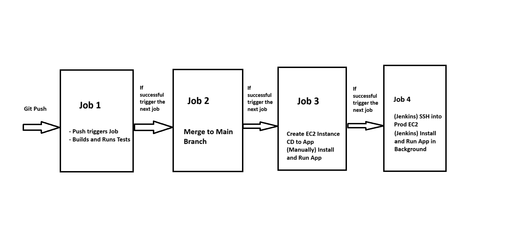

# Tech 258 - Jenkins

- [Tech 258 - Jenkins](#tech-258---jenkins)
  - [Jenkins Overview](#jenkins-overview)
  - [Job Plan](#job-plan)
    - [**Job 1** - **CI**:](#job-1---ci)
    - [**Job 2** - **CI-Merge**:](#job-2---ci-merge)
    - [**Job 3** - **CD**:](#job-3---cd)
    - [**Job 4** - **CDE**:](#job-4---cde)
  - [Job 1 - Jenkins (CI)](#job-1---jenkins-ci)
    - [Steps](#steps)
  - [Configuring Webhook](#configuring-webhook)
    - [Steps](#steps-1)
  - [Testing Webhook](#testing-webhook)
  - [Job 2 - Jenkins (CI-Merge)](#job-2---jenkins-ci-merge)
    - [Steps](#steps-2)
    - [Testing](#testing)
  - [Job 3 - Jenkins (CD)](#job-3---jenkins-cd)
    - [Steps](#steps-3)
  - [Job 4 - Jenkins (CDE)](#job-4---jenkins-cde)
    - [Steps](#steps-4)
  - [Combining CD/CDE](#combining-cdcde)


## Jenkins Overview
Jenkins is an open source automation server. It helps automate the parts of software development related to building, testing, and deploying, facilitating continuous integration, and continuous delivery.

CICD with Jenkins: <br>


## Job Plan
Every task that is done on Jenkins is referred to as a `job`.
In our case, we will have 4 jobs:
### **Job 1** - **CI**:
Outline: Push event to GitHub Repo will act as a trigger for a webhook to this job -> Builds latest version of app and runs automated tests.
### **Job 2** - **CI-Merge**:
Steps Overview:
1) Create a dev branch using `git checkout -b dev`
2) Make a change locally and push to GitHub.
3) If `Job 1` is successful, merge the code from `*/dev` to `*/main`.
### **Job 3** - **CD**:
Steps Overview:
1) Create an EC2 instance (Ubuntu 18.04 LTS)
2) Security Groups: Allow, SSH (22), Jenkins (8080), Node (3000), HTTP (80)
3) Setup required dependencies (NodeJS, Nginx, PM2)
4) Get the tested code from Job 2 onto App EC2.
5) SSH in and manually start app process (npm install, npm start).
### **Job 4** - **CDE**:
Steps Overview: 
1) Let Jenkins SSH into our EC2 (without user input). Give Jenkins credentials (SSH Agent) so it has the private key of our EC2 instance.
2) Jenkins will go to app folder.
3) Jenkins will start app automatically and in the background (pm2 start)

Job Plan Overview Diagram:


## Job 1 - Jenkins (CI)
### Steps
1) First login to Jenkins on your Master Node (ec2) to use the Jenkins service.
2) Click `New Item` or `Create new job` (this option will show if the master node is fresh) to start making a job.
3) Enter a `item name` that follows a suitable naming convention. (example: shafique-ci) Select `Freestyle project` for this case. Click `OK` when ready to continue.
4) For the first section (Important fields):
   
- `Description`: Enter description of job (example: Building CI for nodejs app)
- Tick `GitHub Project` and enter `Project URL`. Put `.git` at the end of the URL.

5) For the `Office 365 Connector` section (Important fields):
- Tick `Restrict where this project can be run`
- `Label Expression`: Give the name of our `agent node`. This node will execute the builds of this project. 
**NOTE**: This is a common error you may get below. To get rid of this just get rid of the trailing space at the end of the label and it should recognise the label. Error example: <br>


Example configuration (with common error corrected): <br>


6) For the `Source Code Management` section (Important fields):

- Select `Git` as that's what we are using for SCM.
- `Repository URL`: Enter the SSH URL for the repo, this can be found on your GitHub Repo by clicking the `Code` button and going to the `SSH` tab of the `Clone` section.
**NOTE**: This is a common error you may get below. This is because Jenkins is trying to ping our repo but it doesn't have permissions due to us setting up SSH. Once we give it the corresponding private key in the `Credentials` tab (next step), this error should resolve itself. Error example: <br>

- `Credentials`: As we have previously assigned a public key to our repo, we need to give Jenkins the corresponding private key to authenticate with our repo. We therefore have to click `Add` and put in our private key there.
Example credentials configuration: <br>

- `Branches to build`: Update `Branch Specifier` to `*/main` as that is the master branch of our repo.

Example configuration (with common error corrected): <br>


7) For the `Build Environment` section (Important fields):
- Tick `Provide Node & npm bin/ folder to PATH`
- `NodeJS Installation`: Select `Sparta-Node-JS`. This has been set up for us to use already! This will also fill out the `npmrc file` and `cache location` fields.

Example configuration: <br>


8) Click `Save` to complete our job configuration.
9) Now we are ready to manually run our job. Click `Build now`. This will run our job. If everything is successful our job in `Build History` will have a blue orb meaning success. To view logs, click the `#1` and select the `Console output` option. Examples: <br>


We can see that our job has been run successfully! <br>


## Configuring Webhook
Now that we have our job configured and tested manually, we can set up a webhook to automatically trigger the job whenever our repo is updated (i.e. a new push event has occurred to our repo). We can set up us Webhook by doing the following:

### Steps
1) Go to our CICD App Repo on GitHub.
2) Go to `Settings > Webhooks (Under Code and Automation Section)`
3) Click `Add Webhook`
- `Payload URL`: This is the URL of our Jenkins Master Node. Example URL: 
```
http://<public_IP_of_jenkins_master_instance>:8080/github-webhook/
```
- `Content type`: application/json
- `Which events would you like to trigger this webhook?`: We can select `Just the push event`. If in future we would like for our Master Node to pull we can select `Let me select individual events` and select `Pull requests` and `Push`. Example: <br>

4) Click `Add Webhook` when ready.

## Testing Webhook
Once the Webhook is created, a test ping will occur. If successful you may see a tick next to your Webhook under the `Webhooks` tab of our GitHub Repo settings. Example: <br>


Another way we can test our webhook is by pushing new content to our repo. For example, we can update the contents of our README.md file and push those changes to GitHub.

**NOTE**: we have to update our job configuration to take the newly made Webhook into account on Jenkins too:
- Go on the Jenkins job and click `Configure`
- Go to the `Build Triggers` section and tick `GitHub hook trigger for GITScm polling`.

Now that we have the webhook set up, a new build should occur and this can be seen on the `Build History` on Jenkins.
Example: <br>


As we can see our build has triggered a second time (#2). We have successfully configured and tested our webhook!

## Job 2 - Jenkins (CI-Merge)
**NOTE**: Before creating this Job we have to update Job 1 to consider a few things:
- Change `Branch Specifier` in `SCM` section to `*/dev` as we now want Jenkins to listen to changes on the `*/dev` branch now.

### Steps
1) First login to Jenkins on your Master Node (ec2) to use the Jenkins service.
2) Click `New Item` or `Create new job` (this option will show if the master node is fresh) to start making a job.
3) Enter a `item name` that follows a suitable naming convention. (example: shafique-ci-merge) Select `Freestyle project` for this case. Click `OK` when ready to continue.
4) For the first section (Important fields):
   
- `Description`: Enter description of job (example: Job to merge dev branch with main branch if shafique-ci job was successful)
- Tick `GitHub Project` and enter `Project URL`. Put `.git` at the end of the URL.
5) For the `Office 365 Connector` section (Important fields):
   - Tick `Restrict where this project can be run`
   - `Label Expression`: Give the name of our `agent node`. This node will execute the builds of this project. 
**NOTE**: This is a common error you may get below. To get rid of this just get rid of the trailing space at the end of the label and it should recognise the label. Error example: <br>

6) For the `Source Code Management` section (Important fields):

- Select `Git` as that's what we are using for SCM.
- `Repository URL`: Enter the SSH URL for the repo, this can be found on your GitHub Repo by clicking the `Code` button and going to the `SSH` tab of the `Clone` section.
**NOTE**: This is a common error you may get below. This is because Jenkins is trying to ping our repo but it doesn't have permissions due to us setting up SSH. Once we give it the corresponding private key in the `Credentials` tab (next step), this error should resolve itself. Error example: <br>

- `Credentials`: As we have previously assigned a public key to our repo, we need to give Jenkins the corresponding private key to authenticate with our repo. We therefore have to click `Add` and put in our private key there.
Example credentials configuration: <br>


Example configuration (with common error corrected): <br>


- `Branches to build`: Update `Branch Specifier` to `*/dev` as that is the branch that we want to merge to `*/main`.
- `Additional Behaviours`: Fill the fields with the following:
  - `Name of repository`: origin
  - `Branch to merge to main`: main
  - `Merge strategy`: default
  - `Fast-forward mode`: --ff
- `Post-build Actions`: Select Git Publisher. Fill the fields with the following:
  - Tick `Push Only if Build Succeeds`: This will act as another layer of assurance of only merging stable `*/dev` branches.
  - Tick `Merge Results`: This will update our `*/main` branch on our GitHub Repo with the merged `*/dev*` branch.

Example: <br>


### Testing
As we want Job 2 to trigger automatically after a successful Job 1:
- Revisit Job 1's configuration
- Go to `Post-build Actions` section and `Add post-build Action`.
- Select `Build other projects` and enter name of `Job 2` in `Projects to build field`.

Now we can push via our `*/dev` branch to our Repo and see if Job 2 works automatically once Job 1 has been deemed successful.

## Job 3 - Jenkins (CD)
### Steps
1) Create an App EC2 instance. Use `ami-02f0341ac93c96375` as Image.
2) First login to Jenkins on your Master Node (ec2) to use the Jenkins service.
3) Click `New Item` or `Create new job` (this option will show if the master node is fresh) to start making a job.
4) Enter a `item name` that follows a suitable naming convention. (example: shafique-cd) Select `Freestyle project` for this case. Click `OK` when ready to continue.
5) For the first section (Important fields):
   
- `Description`: Enter description of job (example: Building CD for nodejs app if tests passed & collecting new code from main branch to push to production on EC2)
- Tick `GitHub Project` and enter `Project URL`. Put `.git` at the end of the URL.
6) For the `Office 365 Connector` section (Important fields):
   - Tick `Restrict where this project can be run`
   - `Label Expression`: Give the name of our `agent node`. This node will execute the builds of this project. 
**NOTE**: This is a common error you may get below. To get rid of this just get rid of the trailing space at the end of the label and it should recognise the label. Error example: <br>

7) For the `Source Code Management` section (Important fields):

- Select `Git` as that's what we are using for SCM.
- `Repository URL`: Enter the SSH URL for the repo, this can be found on your GitHub Repo by clicking the `Code` button and going to the `SSH` tab of the `Clone` section.
**NOTE**: This is a common error you may get below. This is because Jenkins is trying to ping our repo but it doesn't have permissions due to us setting up SSH. Once we give it the corresponding private key in the `Credentials` tab (next step), this error should resolve itself. Error example: <br>

- `Credentials`: As we have previously assigned a public key to our repo, we need to give Jenkins the corresponding private key to authenticate with our repo. We therefore have to click `Add` and put in our private key there.
Example credentials configuration: <br>

8) For the `Build Environment` section (Important fields):
- Tick `Provide Node & npm bin/ folder to PATH`
- `NodeJS Installation`: Select `Sparta-Node-JS`. This has been set up for us to use already! This will also fill out the `npmrc file` and `cache location` fields.
- Add `SSH Agent`: For `Credentials` insert the contents of `tech258.pem` (private key) so Jenkins can SSH into our App EC2 instance to set up our app.
Example: <br>

9) For the `Build` section (Important fields):
- Select `Execute shell`
- For the command this is where we will run our shell script so that Jenkins can:
  - Bypass key checking option
  - SSH into EC2
  - Run update & upgrade
  - Install Nginx
  - Copy new code
  - Navigate to the folder where our script is (env then app folder environment/app)
  - Install the required dependencies using script (run provision.sh)

**NOTE: We will enter our final script in the field above. To ensure it works, we will break it down into sections and test manually:
- First section: **Bypass key checking option -> Install Nginx step** commands:
```
# Bypass key checking option using StrictHostKeyChecking and SSH into EC2
ssh -o "StrictHostKeyChecking=no" ubuntu@ec2-3-254-79-217.eu-west-1.compute.amazonaws.com <<EOF
# Run update & upgrade
sudo apt-get update -y
sudo DEBIAN_FRONTEND=noninteractive apt-get upgrade -y
# Install, restart and enable Nginx service
sudo DEBIAN_FRONTEND=noninteractive apt-get install nginx -y
sudo systemctl restart nginx
sudo systemctl enable nginx

EOF
```
To verify this has worked we will check the public IP of our app instance and should see the default nginx template: <br>


- Second section: **Copy new code** commands:
```
rsync -avz -e "ssh -o StrictHostKeyChecking=no" app ubuntu@ec2-3-254-79-217.eu-west-1.compute.amazonaws.com:/home/ubuntu
rsync -avz -e "ssh -o StrictHostKeyChecking=no" environment ubuntu@ec2-3-254-79-217.eu-west-1.compute.amazonaws.com:/home/ubuntu
```

- Third section: **Navigate to our provision.sh script and run it to install dependencies required to run app** commands:
```
cd environment/app
sudo chmod +x provision.sh
./provision.sh
```

Now that we have done everything manually we can combine it together to create a script for Jenkins to use in the `Build` section: Script
```
# Bypass key checking option using StrictHostKeyChecking and SSH into EC2
ssh -o "StrictHostKeyChecking=no" ubuntu@34.244.217.61 <<EOF
# Run update & upgrade
sudo apt-get update -y
sudo DEBIAN_FRONTEND=noninteractive apt-get upgrade -y
# Install, configure reverse proxy, restart and enable Nginx service
sudo DEBIAN_FRONTEND=noninteractive apt-get install nginx -y
sudo sed -i '51s/.*/\t        proxy_pass http:\/\/localhost:3000;/' /etc/nginx/sites-enabled/default
sudo systemctl restart nginx
sudo systemctl enable nginx

EOF
# Copy new code (app & environment folders) to App Instance
rsync -avz -e "ssh -o StrictHostKeyChecking=no" app ubuntu@34.244.217.61:/home/ubuntu
rsync -avz -e "ssh -o StrictHostKeyChecking=no" environment ubuntu@34.244.217.61:/home/ubuntu
# SSH back in, Navigate to and run script to install app dependencies
ssh -o "StrictHostKeyChecking=no" ubuntu@34.244.217.61 <<EOF
sudo chmod +x ~/environment/app/provision.sh
sudo bash ./environment/app/provision.sh
EOF
```

**IMPORTANT**: To get the script working correctly I had to update the contents of the `provisions.sh` script. I had to add `npm install` before installing pm2 & download node v10 rather than node v6!

CD/CDE Working correctly example: <br>


## Job 4 - Jenkins (CDE)
Now that we have the CD portion of our pipeline configured, we now want Jenkins to deploy our app automatically so the plan would be to:
1) Navigate to App folder
2) Gracefully kill app process (for cases where it is already running)
3) Start a new app process

### Steps
1) First login to Jenkins on your Master Node (ec2) to use the Jenkins service.
2) Click `New Item` or `Create new job` (this option will show if the master node is fresh) to start making a job.
3) Enter a `item name` that follows a suitable naming convention. (example: shafique-app-deployment) Select `Freestyle project` for this case. Click `OK` when ready to continue.
4) For the first section (Important fields):
   
- `Description`: Enter description of job (example: shafique-app-deployment - on an ec2-ip: 54.78.30.24)
- Tick `GitHub Project` and enter `Project URL`. Put `.git` at the end of the URL.
5) For the `Office 365 Connector` section (Important fields):
   - Tick `Restrict where this project can be run`
   - `Label Expression`: Give the name of our `agent node`. This node will execute the builds of this project. 
**NOTE**: This is a common error you may get below. To get rid of this just get rid of the trailing space at the end of the label and it should recognise the label. Error example: <br>

6) For the `Source Code Management` section (Important fields):

- Select `Git` as that's what we are using for SCM.
- `Repository URL`: Enter the SSH URL for the repo, this can be found on your GitHub Repo by clicking the `Code` button and going to the `SSH` tab of the `Clone` section.
**NOTE**: This is a common error you may get below. This is because Jenkins is trying to ping our repo but it doesn't have permissions due to us setting up SSH. Once we give it the corresponding private key in the `Credentials` tab (next step), this error should resolve itself. Error example: <br>

- `Credentials`: As we have previously assigned a public key to our repo, we need to give Jenkins the corresponding private key to authenticate with our repo. We therefore have to click `Add` and put in our private key there.
Example credentials configuration: <br>

7) For the `Build Environment` section (Important fields):
- Tick `Provide Node & npm bin/ folder to PATH`
- `NodeJS Installation`: Select `Sparta-Node-JS`. This has been set up for us to use already! This will also fill out the `npmrc file` and `cache location` fields.
- Add `SSH Agent`: For `Credentials` insert the contents of `tech258.pem` (private key) so Jenkins can SSH into our App EC2 instance to set up our app.
Example: <br>

8) For the `Build` section (Important fields):
- Select `Execute shell`
- For the command this is where we will run our shell script so that Jenkins can execute our plan. The commands would be:
  So our commands for this would be:
```
cd app
pm2 stop all
pm2 start app.js app
```

CD/CDE Working correctly example: <br>


## Combining CD/CDE
If we wanted to combine the two jobs into one we'd have to combine our scripts. Combined Script:
```
# App Instance IP
EC2_IP=54.78.30.24
# Bypass key checking option using StrictHostKeyChecking and SSH into EC2
ssh -o "StrictHostKeyChecking=no" ubuntu@$EC2_IP <<EOF
# Run update & upgrade
sudo apt-get update -y
sudo DEBIAN_FRONTEND=noninteractive apt-get upgrade -y
# Install, restart and enable Nginx service
sudo DEBIAN_FRONTEND=noninteractive apt-get install nginx -y
sudo sed -i '51s/.*/\t        proxy_pass http:\/\/localhost:3000;/' /etc/nginx/sites-enabled/default
sudo systemctl restart nginx
sudo systemctl enable nginx

EOF
# Copy new code (app & environment folders) to App Instance
rsync -avz -e "ssh -o StrictHostKeyChecking=no" app ubuntu@$EC2_IP:/home/ubuntu
rsync -avz -e "ssh -o StrictHostKeyChecking=no" environment ubuntu@$EC2_IP:/home/ubuntu
# SSH back in, Navigate to and run script to install app dependencies
ssh -o "StrictHostKeyChecking=no" ubuntu@$EC2_IP <<EOF
sudo chmod +x ~/environment/app/provision.sh
sudo bash ./environment/app/provision.sh
# Navigate to app directory
cd app
# Gracefully kill/start a new app process using pm2
pm2 stop all
pm2 start app.js app
EOF
```