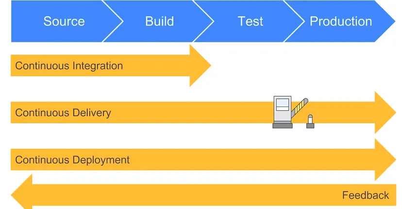

# Tech 258 - CICD

## CICD Overview
CICD is considered as the **backbone** of DevOps practices and automation, commonly in the form of a CI/CD Pipeline. Let's break this up to understand what is considered when creating these pipelines.

## Continuous Integration (CI)
It is a development practice where developers regularly merge their code changes into a central repository, specifically the master branch. When this happens, a fully automated build and test process will be initiated, giving feedback within minutes. This process avoids the integration challenges that may happen when waiting for release day when merging into the release branch.

Part of the SDLC:
Source -> Build -> Test

## Continuous Delivery (CD)
This is an extension of CI, since it automatically deploys all code changes to a testing/production environment after the build stage. This means we have automated our release process and can now deploy our application at any point of time by clicking a button.

**NOTE**: Deployment is completed **MANUALLY**.

Part of the SDLC:
Source -> Build -> Test -> Production (Manual)

## Continuous Deployment (CDE)
This is an extension of CD, taking it a step further by ensuring every change that passes each stage of our pipeline is released to your customers **automatically**, only a failed test will prevent a new change from being deployed to production.

This get's rid of the 'release day' problem, taking away that pressure from the team as now developers can focus on building software and seeing that software go live minutes after they've finished working on it.

## How do they relate to one another?
In it's simplest form, CI is part of both CD and CDE.

In the case of CD, deployment to production is manual but for CDE this process is automated.

CICD Workflow diagram:

