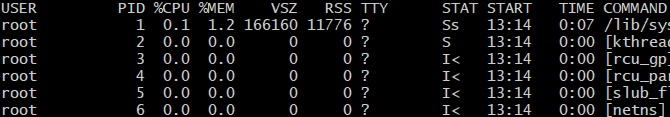

# Tech 258 - Linux Processes

- [Tech 258 - Linux Processes](#tech-258---linux-processes)
  - [How do we view processes?](#how-do-we-view-processes)
    - [ps aux command](#ps-aux-command)
    - [How do we filter the `top` command output?](#how-do-we-filter-the-top-command-output)
  - [How do we run a process in the background?](#how-do-we-run-a-process-in-the-background)
  - [Parent and Child Processes](#parent-and-child-processes)
  - [How do we kill a process?](#how-do-we-kill-a-process)


## How do we view processes?
To view processes we can use the `ps` command for a snapshot, or the `top` command which will show the top processes in a up-to-date, real-time view. There is also the `jobs` command, which is mainly for viewing background processes.

### ps aux command
This command will display the most amount of information a user usally needs to understand the current state of their system's running processes. Example usage: <br>
```
ps aux
```

Example output: <br>


Breaking down important columns:

- `VSZ` - Amount of virtual memory consumed by the process.
- `RSS` - Physical wired-in memory used by the proces.
- `TTY` - Acts as an identifier for the current terminal session.

### How do we filter the `top` command output?
You can filter the format of the `top` command's output with the following inputs (some examples): <br>

- **`Shift + M`**: Order based on memory usage (%MEM).
- **`Shift + N`**: Order based on newest processes at the top (PID).
- **`Shift + P`**: Order based on processor usage (%CPU).

## How do we run a process in the background?
To run a process in the background, add an `&` to the end of a command. Example usage: <br>
```
<command> &
```

Making a process run in the background will leave the terminal unoccupied so we can still interact with the terminal.

## Parent and Child Processes
A parent process is a process that creates a child process and in a sense is responsible for that process.

- Good to understand the hierarchy as if we were to wipe out a parent process, the child processes may not have a parent to manage them, yet they are still running. They will therefore become zombie processes, sitting there taking up memory. 
- If we were to wipe a child process, the parent process is responsible and will therefore try to restart the process once it notices it has been wiped out. 
- Killing processes is seen as the last resort, we should try to get the parent process itself to get rid of the child process rather than forcefully getting rid of it.

## How do we kill a process?

There are 64 different kill signals, here are the two most common signals:
- Termination (Level 15) – Terminate gracefully. This is the default. Stops zombie processes from happening. Says terminated. Example usage: <br>
  ```
  kill <process_ID>
  ```  
- Brute Force Kill – This time when running `jobs -l` it says Killed. This is the harshest. This may create zombies if we kill parent processes. Example usage: <br>
  ```
  kill -9 <process_ID>
  ```

