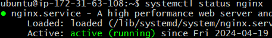
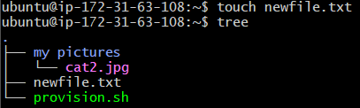

# Tech 258 - Linux

- [Tech 258 - Linux](#tech-258---linux)
  - [General Commands](#general-commands)
    - [uname](#uname)
    - [whoami](#whoami)
    - [history](#history)
    - [ps](#ps)
    - [curl](#curl)
    - [sudo](#sudo)
    - [chmod](#chmod)
    - [systemctl](#systemctl)
    - [printenv](#printenv)
    - [export](#export)
  - [Commands that work with files](#commands-that-work-with-files)
    - [file](#file)
    - [ls](#ls)
    - [ll](#ll)
    - [mv](#mv)
    - [cp](#cp)
    - [rm](#rm)
    - [touch](#touch)
    - [nano](#nano)
    - [cat](#cat)
    - [grep](#grep)
  - [Commands that work with directories](#commands-that-work-with-directories)
    - [mkdir](#mkdir)
    - [rm -r](#rm--r)
    - [cd](#cd)
    - [pwd](#pwd)


## General Commands
These are common commands used to give us more information about general things like the shell itself or about the user.

### uname
This command gives us more information about the OS we are using. We can use the --help flag to tell us how to get more out of the usage of this command. 

Usage:

```
uname
```
Example output: <br>


### whoami
This command tells us what user we are. 

Usage:
```
whoami
```

Example output: <br>


### history
This command keeps a log of the last 500 commands we have used previously. We can use the `-c` flag to clear the log.

Usage:
```
history
```

Example output: <br>


### ps
This command will list the currently running processes. We can use the `-p` flag to identify a specific process. In this case we can flag `$$` to identify the current shell process.

Usage:
```
ps -p $$
```

Example output: <br>


### curl
This command is the primary way to transfer data i.e. download files. We will use the `--output` flag to store this data in a file.

Usage:
```
curl --output <desired_file_name> <url>
```

Example output: <br>


As you can see, we have downloaded the image from the given url and have stored the image in a file called `cat.jpg`.

### sudo
This command, standing for "super user do", is used to preface any other command to run said command with elevated privileges e.g. for administrative tasks.

Usage:
```
sudo <command>
```

Example output: <br>


We used `sudo` to give us superuser privileges in order to start the `nginx` service.

### chmod
This command will allow for an administrator to set or modify a file or directory's permissions.

There are 3 groups you will have to set permissions for being:
1) File's owner
2) File's group
3) Everybody else

To calculate these privileges, read is worth a value of `'+4'`, write is worth a value of `'+2'`, and execute is worth a value of `'+1'`.

Now that we know how to calculate permissions, we can use the command.

Usage:
```
chmod <value> <file/directory_name>
```

Example output: <br>


In this case, we have given every type of user read, write and execute privileges to the file `cat.jpg`.

### systemctl
This command is used to control a system process. It has many uses e.g. starting, stopping, enabling, restarting, checking the status of a service, etc. This is normally a good time to use `sudo` as a prefix.

Usage:
```
systemctl <keyword> <service>
```

Example output: <br>


In this case, we checked the status of the `nginx` service.

### printenv
This command is used to print out a list of our environmental variables. We can also specify to print a certain environmental variable, but if left blank it'll print them all.

Usage:
```
printenv <variable_name>
```

Example output: <br>


In this case, we have printed out the environmental variable `SHELL`. **Remember**: Linux is case-sensitive.

### export
This command is used to set a new environmental variable. This will only persist for this current session, if we want it to persist, we will have to manually add it to the `.bashrc` hidden file.

Usage:
```
export <VARIABLE_NAME>=<value>
```

Example output: <br>


In this case, we have set the variable `MYNAME` with the value `shafique`. We can see that it has worked by using the `echo` command to display the variable. When specifying a variable make sure to preface it with the character `$`.


## Commands that work with files
These are common commands used when working with files.

### file
This command will tell us what type of file the specified file is.

Usage:
```
file <file_name>
```

Example output: <br>


The output tells us that the file `cat.jpg` contains JPEG image data.


### ls
This command will list the files and directories within our given directory. This is the most common command used to find your bearings!

Usage:
```
ls
```

Example output: <br>


This output shows that within our home (~) directory, we have a `cat.jpg` file and a `'my pictures'` directory.

### ll
This command is a more indepth version of ls, (similar to ls -a). It also displays extra information like, permissions, owners, last time modified, etc.

Usage:
```
ll
```

Example output: <br>


### mv
This command is used to either move a file or rename a file.

Usage:
```
mv <file_name> <new_name/new_location>
```

Example output: <br>


In this case, we use `ls` to verify that the file `cat.jpg` has been renamed to `cat2.jpg`

### cp
This command is used to make a copy of a file.

Usage:
```
cp <file_name> <destination>
```

Example output: <br>


In this case, I made a copy of the `cat2.jpg` file in the `"my pictures"` directory.

### rm
This command is used to remove files/directories. As this is the files section, we will remain with the basic usage case.

Usage:
```
rm <file_name>
```

Example output: <br>


In this case, `cat2.jpg` has been removed from the home directory.

### touch
This command is used to make an empty file with specified name.

Usage:
```
touch <file_name>
```

Example output: <br>


We have created the file `newfile.txt` in the home directory.

### nano
This command allows for us to make changes to a file, using the text-based editor `nano`.

Usage:
```
nano <file_name>
```

Example output: <br>


When executing the command, it opens the `nano` editor where you can make changes. In this case I added `Hello World!` to the file. To exit and save changes: <br>
1) Ctrl + X --> To Exit
2) Y --> Yes
3) File Name to Write: `<file_name>` --> If you want to keep the file name the same, just click enter.

This should complete the editing process.

### cat
This command will display the contents of a file.

Usage:
```
cat <file_name>
```

Example output: <br>


As we edited the `newfile.txt` file in the previous section, when we use `cat` to display the file, we can now see it has `Hello World!` as it's contents!

### grep
This command allows for us to search for specific text patterns in files.

Usage:
```
grep "<text_pattern>" <file_name>
```

Example output: <br>


The output will also highlight the pattern we queried for, in this case, being `Hello`.

## Commands that work with directories
These are common commands used when working with directories.

### mkdir
This command is used to create a new directory.

Usage:
```
mkdir <directory_name>
```

Example output: <br>


The output displays the creation of `new_directory` within our home directory.

### rm -r
This command is an extension of the `rm` command, adding the `-r` flag allows for the recursive deletion of directories.

Usage:
```
rm -r <directory_name>
```

Example output: <br>


The output shows that `new_directory` has been deleted.

### cd
This command is used to change what directory we are currently in. The current directory we are in should be taken into consideration as the path you take to change directory will be relative.

Usage:
```
cd <desired_directory>
```

Example output: <br>


As you can see, we have gone from the home directory `~` to the `'my pictures'` directory.

### pwd
This command is used to see what current directory we are working in.

Usage:
```
pwd
```

Example output: <br>


The output shows we are currently in the home directory. The home directory in this case has the path `/home/ubuntu`.
