# Tech 258 - Nginx Deployment

## Step 1 - Launching EC2 instance
When you access the AWS Console, in the search box type `EC2` to access the EC2 dashboard. Once on the dashboard, click the `Launch instance` button to launch an instance.

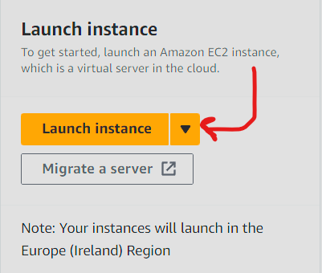

Now we can start creating our instance with our desired inputs. Firstly, to get started we must name our instance. Make sure this name is something meaningful to make it easy to identify your instance and it's purpose.

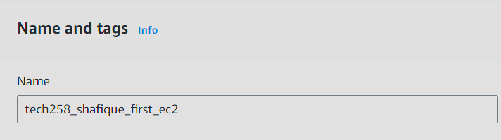

Now we must specify the Application and OS Image we want to use for our instance. This is also known as the Amazon Machine Image (AMI).

An AMI is a template used that contains the software configuration (os, application server and applications) that we require to launch our instance. In our case, we'll use the `Ubuntu` AMI, as shown by the image below:

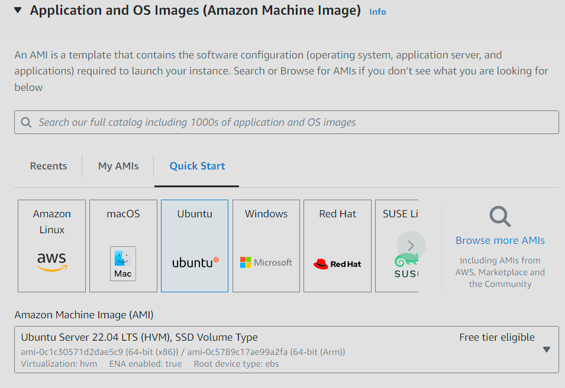

Now we must specify the Instance type. As DevOps Engineers we want to use only what is necessary and therefore in this case we will use the `t2.micro` instance type. Moreover, it is a free tier eligible instance type allowing us to use this instance for free (adhering to monthly usage quota). Full free tier documentation can be seen [here.](https://aws.amazon.com/free/?all-free-tier.sort-by=item.additionalFields.SortRank&all-free-tier.sort-order=asc&awsf.Free%20Tier%20Types=*all&awsf.Free%20Tier%20Categories=*all)

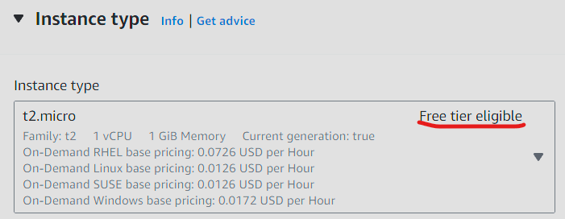

To now access our instance, we can configure a SSH Key Pair to create a secure communication channel for this connection to take place.

A SSH Key Pair will assign the public key to the server and generate a corresponding private key (.pem file) that we can use to unlock this connection to the remote instance we are creating.

In this case we have previously made our key pair and it is called `tech258`, so we will put that as our key pair name.

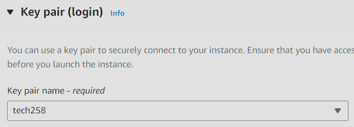

We now have to configure our instance's network settings. This will dictate who has access and on what port this access will occur. We will create a security group which will act as a firefall to do this. Firstly, we will click the `Edit` button to configure our network settings manually.

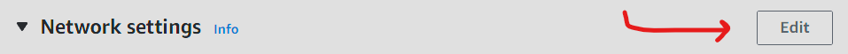

We will then enter the following fields:

- Security group name
- Description
- Inbound Security Group Rules

For our Inbound Security Group Rules, we will have 2 Rules:

- Rule 1: Type SSH, Source Anywhere
- Rule 2: Type HTTP, Source Anywhere

These Rule will allow for us to SSH into the instance anywhere and access the instance's public IP address from anywhere.

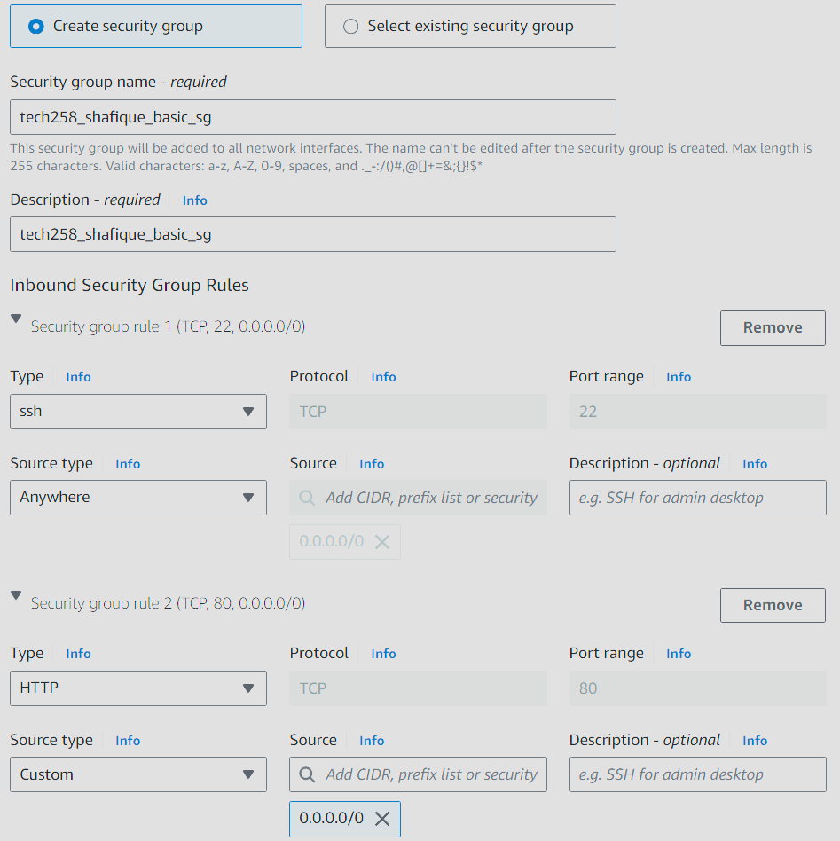

These connections will occur using the ports that correspond to the type of traffic. Ports are numbers assigned to these different types of traffic to uniquely identify the connection endpoint and to then direct data to the specified service.

Now we can see a summary of our instance and verify if everything is as we desire before we click the `Launch Instance` button. Use this as a time to verify everything is correct before proceeding.

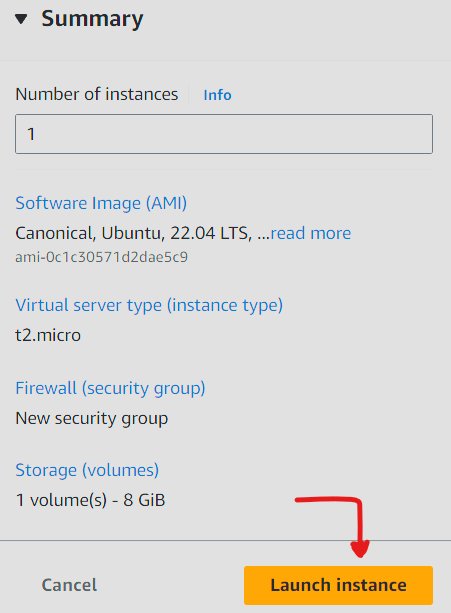

## Step 2 - Connect to Instance

Now that we have launched our instance and it has entered the `Running` state, we can now connect to our instance! This is done through the `Connect` button.

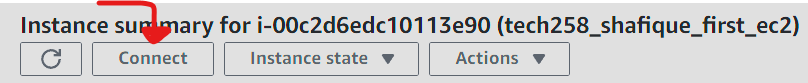

Now navigate to the `SSH Client` section and follow the instructions kindly given to us by the AWS console.

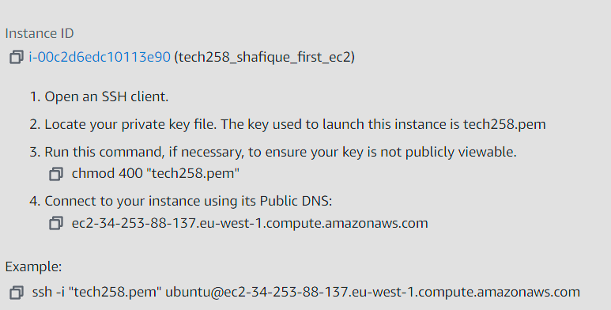

If successful, we have now connected to our instance! This is shown by our user now being `ubuntu` at the instance's private IP address.

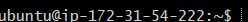

## Step 3 - Update & Upgrade Instance

We must now run the following commands:

```
sudo apt update -y
sudo apt upgrade -y
```
The first command will refresh and download our local packages and provide the system with information about the latest versions of these packages.

When we are ready to upgrade our packages to these latest versions, that is when we will `upgrade` our packages.

We separate this process to reduce the likelihood of conflicts from occuring, similarly to the Git workflow.

Once we have the latest versions of the packages installed on our instance we now install nginx, which can be done with the following command.

```
sudo apt install nginx -y
```

### What is Nginx?
Nginx is an open-source web server software used for a variety of reasons including:

- Reverse proxy
- Load balancing
- Caching

We are installing it this case to make our server have the capability to server HTML content when we access our instance using our web browser.

Once nginx has installed, we can check the status of the service i.e. if nginx is running through the following command:
```
systemctl status nginx
```

If everything went well the status should be `active (running)`.


### Why do we add the -y flag?
This flag allows for automation. Normally, when the above commands are executed without this flag, the CLI will prompt the user for a confirmation. This `-y` flag will tell the CLI, everytime a confirmation request happens, answer with `Yes`.

### Why do we use sudo?

For these commands, we use the keyword `sudo` to give us superuser privilege, for the command only, in order to make sure the command is executed without any problems.

## Final Step - Accessing our Server via Browser

To access our instance through the web, we must get the public IP address of our instance. This can be done through the AWS console.

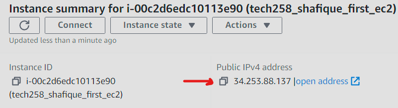

As we have configured nginx, we should be greeted with the following page:

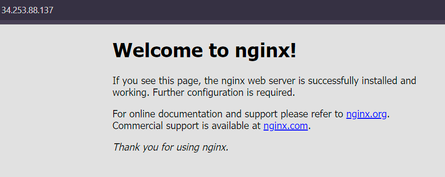