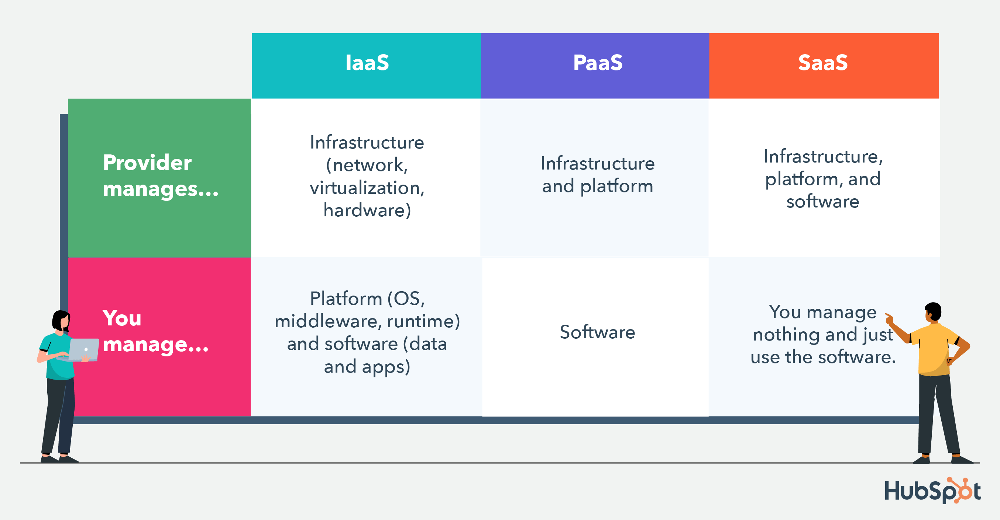

# Tech 258 - Cloud

## What is Cloud Computing?
Cloud Computing is the on-demand delivery of IT resources over the Internet. The Cloud itself can be seen as a vast network of interconnected servers and facilities all around the world. This therefore means that we can use cloud computing as a way of using these resources without needing to purchase them outright for personal use, we can now rent these resources from Cloud Providers, such as Amazon Web Services (AWS), Microsoft Azure or Google Cloud Platform (GCP).

## How do we know if something is in the cloud? 
There are many indicators that show if a resource is on the cloud, some of these are:

- **Domain or URL**: The URL of a cloud-hosted service may often have cloud-specific domain names. e.g. `aws.amazon.com`
- **Service Provider Info**: A cloud resource is commonly provided by a Cloud provider, so it may have information about what provider is hosting said resource.
- **API Endpoints**: Cloud services often have distinct API endpoints specific to the cloud provider's infrastructure.

## What are the differences between on-prem and the cloud?

- **Location**: On-Premise resources are physically located within the organisation's own data centers, giving them full ownership over their infrastructure. Cloud resources are hosted and managed by third-party cloud service providers in remote data centers that are distributed across the globe. Users will access the cloud resources over the Internet.
- **Ownership**: On-Premise resources are owned by the organisation themselves whereas Cloud resources are owned by Cloud Providers e.g. AWS, Azure, GCP.
- **Scalability**: On-Premise resources require additional hardware procurement, installation and configuration when scaling takes place. Cloud resources on the other hand are more flexible as you can just demand more resources from the Cloud Provider.

## The 4 deployment models of Cloud: Private vs Public vs Hybrid vs Multi-Cloud

### Private Cloud
The Private Cloud is a single cloud computing environment that is dedicated to a single organisation. This means all resources are isolated and in the control of one organisation. Also known as *internal* or *corporate* cloud.

### Public Cloud
The Public Cloud is a shared cloud among multiple users and is therefore typically the most cost-effective option. These resources are provided by Cloud Providers like AWS, Azure and GCP.

### Hybrid Cloud
A Hybrid Cloud is a mixed computing environment where applications and services are run in different environments (public and private), including on-premise data centers. This is the most widespread option because in the current day, almost no one relies entirely on a single public cloud.

### Multi-Cloud
A Multi-Cloud is when an organisation uses cloud computing services from at least two different cloud providers to run their applications. These multi-cloud environments typically include a combination of two or more public clouds, two or more private clouds or some combination of both.

## Types of Cloud Services: IaaS, PaaS, SaaS

### Infrastructure as a Service (IaaS)
IaaS is a type of cloud computing service that offers essential compute, storage, and networking resources on demand. With IaaS, users have full control over the operating systems, applications and middleware deployed on the virtualized infrastructure. Some examples include, AWS EC2, Azure Virtual Machines and Google Cloud Compute Engine.

### Platform as a Service (PaaS)
PaaS is a type of cloud computing service that offers a complete development and deployment environment in the cloud. This gives resources that enable you to deliver everything from simple cloud-based apps to sophisticated, cloud-enabled enterprise applications. This service also takes away the complexity of building and maintaining the underlying infrastructure. Some examples include, Heroku, AWS Elastic Beanstalk and OpenShift.

### Software as a Service (SaaS)
SaaS is a type of cloud computing service that leverages the internet to deliver applications which are managed by a third-party vendor, to its users. You rent the use of an app for your organisation which allows you to quickly get the app up and running at minimal upfront cost. Some examples include, Dropbox, Microsoft Office 365, Netflix.

## What are the advantages/disadvantages of the cloud?
### Advantages

- **Scalability/Flexibility**: Cloud services give organisations the opportunity to quickly scale up/down based on demand. This agility enables said organisations to respond rapidly to changing market conditions.
- **Cost Savings**: Cloud computing normally operates on a pay-as-you-go pricing model, reducing upfront costs and allowing organisations to align costs with actual usage. This eliminates the need for expensive hardware purchases.
- **Security and Compliance**: Cloud providers invest heavily in security measures, like encryption and identity management so by using their cloud resources we can benefit from these security enhancements.

### Disadvantages
- **Vendor Lock-in**: Using cloud services from a single provider may lead to vendor lock-in, which may make it difficult to migrate to alternate providers in the future. Businesses may face challenges in integrating with other systems.
- **Dependency on Internet Connectivity**: Cloud computing relies on internet access to applications and data. If businesses experience downtime or disruptions in service due to internet outages, they will lose access to their resources.
- **Data Privacy and Control**: Storing sensitive data in the cloud raises data privacy concerns. Businesses may have limited control and visibility over their data stored in these environments.

## Difference between OpEx and CapEx
Operating Expenditure (OpEx) and Capital Expenditure (CapEx) are two terms used to understand the impact cloud computing may have on business expenditure.

### OpEx
OpEx is the ongoing cost associated with the day-to-day operations of running and maintaining IT infrastructure. Some examples are Cloud service fees, IT staff salaries and internet costs.

### CapEx
CapEx is the upfront costs associated with acquiring and deploying IT hardware and software. Some examples including, purchasing servers, upgrading data centers or buying software licenses.
## Is migrating to the cloud always cheaper?
Although the cloud is generally cost-saving, there may be some situations where moving to the cloud could result in being more expensive.

For example, if your organisation has stable workloads and predictable usage patterns, such as systems with low demand variability, the cost savings from the agility that comes with the cloud may be minimal, so it may be more beneficial to stay with on-premise hardware.

## Market-share Breakdown - What are the 3 largest providers known for?

From diagram above we can see that:

- AWS is the dominant player, with a market share of approximately 34%. AWS is known for its reliability and breadth of services.
- Microsoft Azure is second with a market share of around 21%. Azure is known for its strong integration with Microsoft products.
- Google Cloud Platform is third with a market share of around 11%. GCP is known for its machine learning expertise and competitive pricing.
- Other providers like IBM Cloud and Alibaba Cloud share the remaining market share, catering to more niche needs.

## Which cloud provider is the best in your opinion?
In my opinion, I think Amazon Web Services (AWS) is the best cloud provider. This is because of the vast library of services they offer on their platform and due to it having the greatest market share, it is easy to find documentation and discussions about how to use certain tools available on the Internet when you need help deploying a service.

## What are the 4 pillars of DevOps? How do they link into the cloud?

The 4 Pillars of DevOps are:

- **Culture**: DevOps emphasises a collaborative and culture-driven approach to software development. This involves fostering trust, communication and shared responsibility among development and other stakeholders. In the cloud, organisations can leverage cloud-native tools like shared repositories and chat platforms to create and establish this culture across distributed teams.
- **Collaboration**: Better collaboration across different teams will help them achieve a streamlined process helping the team in preparing the best approach in terms of target infrastructure. In terms of the cloud, collaboration could be achieved when using different cloud services.
- **Automation**: The most known pillar of DevOps. This plays a crucial role in the continuous delivery and deployment of software through automated pipelines. In the cloud, organisations can leverage cloud automation services, like AWS CloudFormation to automate the provisioning and management of cloud resources, reducing manual effort. Automatic scaling up/down based on demand can be achieved as well, using features like Auto Scaling Groups (ASGs).
- **Monitoring**: This involves establishing metrics and monitoring systems to continuously assess and improve the quality and efficiency of software delivery and operations. In the cloud, organisations can leverage cloud monitoring through the vast library of monitoring tools provided by cloud providers, such as AWS CloudWatch and Azure Monitor. These help identify performance bottlenecks and thus drive continuous improvement ideas.

